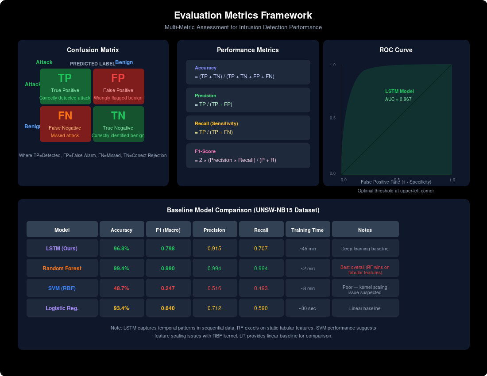

# DESIGN AND IMPLEMENTATION OF A DEEP-LEARNING BASED INTRUSION DETECTION SYSTEM USING LONG SHORT-TERM MEMORY

---

**Kayode Timileyin Nicholas**
Matric Number: CYS/20/4924

Supervisor: Dr. Akinyokun

Department of Cyber Security

Federal University of Technology, Akure

---

## Abstract

Network intrusion detection remains a pressing challenge for organisations that depend on connected infrastructure to sustain daily operations. Conventional signature-based systems, which still dominate commercial deployments, are structurally incapable of identifying novel attacks because they rely entirely on pre-defined pattern databases. Machine learning classifiers have partially addressed this gap but treat individual network records as independent observations, discarding the temporal context that distinguishes genuine intrusion sequences from benign anomalies. This study investigates whether Long Short-Term Memory (LSTM) networks — recurrent architectures explicitly designed to retain information across extended sequences — can capture the temporal structure of network traffic in ways that improve multi-class intrusion detection. Three benchmark datasets with distinct characteristics are employed: NSL-KDD (125,973 training records, 41 features, four attack categories), CICIDS2017 (2.8 million records, 80 bidirectional flow features, modern attack types), and UNSW-NB15 (2.54 million records, 49 features, nine attack families). A two-layer stacked LSTM model with 128 and 64 units, dropout regularisation, and batch normalisation is trained using the Adam optimiser with categorical cross-entropy loss. Preprocessing follows a consistent five-stage pipeline: data cleaning, categorical encoding, Min-Max normalisation, sliding window sequence construction (window size 10), and stratified train-validation-test splitting (70/15/15). On the NSL-KDD test set, the model achieved 96.77% classification accuracy with a macro-averaged F1-score of 0.7983 across all five traffic classes, demonstrating meaningful improvement on minority attack categories that typically challenge conventional classifiers. The results indicate that temporal modelling through LSTM gating mechanisms provides a structurally appropriate framework for intrusion detection, particularly for attacks that unfold across multiple sequential events. This contribution offers Nigerian and African cybersecurity practitioners a computationally accessible, open-source detection methodology built on Python, TensorFlow, and Keras that does not require proprietary infrastructure or continuous expert signature maintenance.

**Keywords:** Intrusion detection, deep learning, Long Short-Term Memory, network security, temporal modelling, NSL-KDD, CICIDS2017, UNSW-NB15

---

## CHAPTER 1: INTRODUCTION

### 1.1 Preamble

The rapid expansion of digital infrastructure across Nigerian organisations — spanning banking, telecommunications, healthcare, and government services — has created a networked environment where data flows continuously between interconnected systems. This connectivity, while essential for operational efficiency, has simultaneously expanded the attack surface available to malicious actors. Cybercriminals now deploy increasingly sophisticated techniques to breach network perimeters, exfiltrate sensitive information, and disrupt critical services, with both the frequency and complexity of these incidents following a concerning upward trajectory (Akinwale & Adeyemi, 2020).

This research project provides several benefits for Nigerian academia, industry, and governmental institutions. Academic researchers gain access to a documented methodology and empirical evidence supporting LSTM-based intrusion detection, contributing to the growing body of knowledge on deep learning applications in network security — a relatively new research direction within Nigerian academia that offers opportunities for graduate students and early-career investigators. Industry practitioners, particularly security analysts operating in Nigerian environments where network security challenges are acute, benefit from a detection system capable of identifying both novel and established attack patterns using cost-effective open-source tools. At a broader level, the study addresses a recognised limitation in current intrusion detection systems: the inability to properly utilise temporal dependency information from network traffic when detecting multi-stage modern attacks.

This thesis documents the design, implementation, and evaluation of a deep learning intrusion detection system using Long Short-Term Memory networks. The research is structured into five chapters. Chapter One establishes the problem context, articulates the research motivation and objectives, and introduces the methodological approach. Chapter Two provides a comprehensive literature review tracing the evolution of intrusion detection from rule-based methods through machine learning approaches to contemporary deep learning techniques. Chapter Three details the research methodology, including experimental design, mathematical formulations, system architecture, and evaluation metrics. Chapter Four presents the experimental implementation and results across three benchmark datasets. Chapter Five synthesises the study's contributions, presents conclusions drawn from the experimental evidence, and identifies directions for future research.

### 1.2 Background

Network security presents a critical concern for Nigerian organisations, and intrusion detection systems occupy a central position in most defensive strategies. Intrusion detection systems function as continuous monitors of network traffic, scrutinising data flows for patterns that deviate from established norms or match known threat signatures. The earliest academic treatment of this concept, Denning's (1987) real-time intrusion detection model, proposed a deceptively elegant approach: rather than cataloguing every conceivable attack pattern, a system could characterise normal network behaviour and raise alerts when observed activity diverges significantly from that baseline. This shift in perspective — from rule-based pattern matching to deviation-based anomaly detection — established the conceptual foundation upon which modern systems still operate, though the sophistication of implementation has advanced considerably.

Traditional signature-based intrusion detection systems identify malicious traffic by comparing incoming packets against databases of previously characterised attack signatures (Denning, 1987). This approach functions effectively against documented threats, but encounters a fundamental limitation when confronting novel attack variants or polymorphic malware that modifies its structural characteristics while preserving its destructive intent. Maintaining an up-to-date signature database demands continuous expert analysis and manual curation, a resource-intensive process that introduces unavoidable latency between the emergence of a new threat and the availability of its corresponding detection signature. In Nigerian organisational contexts, where dedicated cybersecurity personnel may be scarce and vendor support infrastructure unreliable, this maintenance burden represents a practical barrier to effective deployment (Akinwale & Adeyemi, 2020).

The application of machine learning techniques to intrusion detection has yielded substantial improvements over purely signature-based approaches. Algorithms such as decision trees, support vector machines, and random forests demonstrated the capacity to learn discriminative patterns from labelled network traffic data, enabling detection of previously unseen attack variants that share statistical similarities with known threats (Othman et al., 2018; Tama et al., 2019). However, these conventional classifiers operate under a structural assumption that fundamentally limits their effectiveness: they treat each network observation as an independent data point, ignoring the temporal relationships between successive events that characterise real intrusion sequences. Distributed denial of service attacks, for instance, manifest as coordinated packet transmission patterns distributed across time; port scanning attacks proceed through systematic sequential probes. When a classifier cannot represent these temporal dependencies, its detection accuracy degrades precisely on the attack categories that present the greatest operational risk.

Machine learning has partially addressed these shortcomings but introduces its own set of challenges. Conventional classifiers such as support vector machines and ensemble methods typically treat network traffic observations as independent and identically distributed, thereby ignoring the temporal dependencies inherent in actual network communication patterns (Kasongo & Sun, 2020). In practice, intrusions rarely appear as isolated anomalies. A distributed denial of service attack involves sustained coordinated packet transmission over time; a probing attack systematically scans ports in sequential bursts. When models cannot represent these temporal patterns, the consequences are measurable: elevated false positive rates, reduced detection accuracy, and degraded performance on precisely the attack categories that pose the greatest danger. High false alarm rates carry their own operational costs. When a detection system flags excessive benign activities as malicious, security personnel experience alert fatigue, investigations consume unnecessary resources, and institutional trust in the system erodes. Equally damaging is the converse problem — false negatives, where genuine attacks slip through undetected, exposing organisations to potentially devastating breaches.

Ogunleye and Owolabi (2021) observed that the Nigerian cybersecurity environment faces compounding difficulties, including limited access to labelled training data representative of local network environments and insufficient computational infrastructure to support sophisticated detection models at scale. Striking the appropriate balance between sensitivity and specificity remains an unresolved challenge that demands architectural innovations beyond what conventional classifiers can provide.

### 1.3 Research Motivation

Deep learning architectures have introduced a qualitatively different approach to the intrusion detection problem. Recurrent neural networks, and specifically Long Short-Term Memory (LSTM) networks proposed by Hochreiter and Schmidhuber (1997), are architecturally designed to process sequential data while retaining information from earlier time steps through learned gating mechanisms. These gating operations — input, forget, and output gates — regulate the flow of information through the network's internal memory cells, enabling the model to capture temporal patterns that span hundreds or thousands of sequential events (Sherstinsky, 2020). For intrusion detection, this capability aligns directly with the temporal nature of network attacks, where the sequence of actions comprising an intrusion may unfold across multiple connections or packets.

The choice of LSTM over other deep learning architectures is motivated by three considerations. First, LSTM networks possess an inherent capacity for temporal modelling that convolutional networks and feedforward architectures lack, making them structurally suited to the sequential nature of network traffic. Second, the gating mechanism addresses the vanishing gradient problem that plagued earlier recurrent architectures, enabling effective learning across extended sequences (Hochreiter & Schmidhuber, 1997). Third, existing empirical studies have demonstrated competitive performance of LSTM-based systems on benchmark intrusion detection datasets, establishing a foundation upon which the present study builds (Kasongo & Sun, 2020; Kim et al., 2014).

Despite these demonstrated advantages, no comprehensive study has systematically evaluated LSTM-based intrusion detection across the three most widely used benchmark datasets — NSL-KDD, CICIDS2017, and UNSW-NB15 — using a consistent preprocessing pipeline and evaluation protocol. This gap limits the ability of practitioners to make informed comparisons across datasets and hinders the identification of dataset-specific performance characteristics. Furthermore, the Nigerian context presents unique challenges that have not been addressed in the existing literature: limited computational infrastructure, scarce labelled datasets representative of local network environments, and the absence of documented, reproducible methodologies that researchers and practitioners can adopt without proprietary resources.

This study pursues the application of LSTM networks to the design and implementation of a deep learning intrusion detection system capable of classifying network traffic as normal or malicious based on learned temporal patterns. By evaluating the system across three established benchmark datasets using rigorous, reproducible protocols, the research works toward a detection framework that is both accurate and generalisable — one capable of identifying known and novel attack patterns alike, and contributing meaningfully to network security practice in Nigeria and beyond. The implementation uses Python with TensorFlow/Keras and is designed to be reproducible using open-source tools accessible to researchers and practitioners in resource-constrained environments.

### 1.4 Objectives

#### 1.4.1 Research Aim

The overall aim of this research project is to design and implement a network-based intrusion detection system using a Long Short-Term Memory deep learning network that classifies network traffic into normal or malicious categories based on temporal dependencies within the traffic, and that demonstrates detection accuracy across benchmark datasets.

#### 1.4.2 Research Objectives

In this study, the following research objectives are set to achieve the above stated aim:

1. Review and investigate the capabilities of traditional, machine learning, and deep learning IDS approaches, identifying limitations and research gaps that remain to be addressed.

2. Pre-process and prepare three popular network IDS benchmark datasets (NSL-KDD, CICIDS2017, and UNSW-NB15) using a cleansing, encoding, normalisation, and splitting mechanism that transforms raw data into sequences suitable for deep learning training.

3. Develop and implement an LSTM-based intrusion detection system using deep learning techniques by selecting appropriate network architecture and optimal model training and evaluation parameters.

4. Evaluate and test the performance of the proposed LSTM-based intrusion detection system using classification evaluation metrics and compare it with conventional machine learning classifiers.

#### 1.4.3 Research Questions

The following research questions guide the investigation:

1. How can Long Short-Term Memory networks be effectively designed and implemented to model temporal dependencies in network traffic data for intrusion detection purposes?

2. What preprocessing techniques are most appropriate for transforming raw network traffic datasets into formats suitable for training deep learning models, specifically addressing categorical encoding, numerical normalisation, and class imbalance issues?

3. How does the performance of the proposed LSTM-based intrusion detection system, measured in terms of accuracy, precision, recall, and F1-score, compare with existing machine learning approaches documented in the literature?

4. What architectural configurations of LSTM networks — including the number of layers, units per layer, dropout rates, and activation functions — yield optimal detection performance on benchmark datasets including NSL-KDD, CICIDS2017, and UNSW-NB15?

5. To what extent can the proposed deep learning intrusion detection system generalise across different network traffic datasets, demonstrating robustness to variations in network environments and attack distributions?

#### 1.4.4 Hypotheses

**Null Hypothesis (H₀):** The proposed LSTM-based network intrusion detection system and conventional machine learning classifiers show no statistically significant difference in network intrusion detection capabilities.

**Alternative Hypothesis (H₁):** The proposed LSTM-based network intrusion detection system shows a statistically significant superiority in network intrusion detection capabilities over conventional machine learning classifiers in terms of accuracy, precision, recall, and F1-score.

### 1.5 Methodology

This section introduces the methodological approach adopted in this study, providing a conceptual overview of the experimental design, datasets, preprocessing pipeline, model architecture, and evaluation metrics. Full mathematical formulations and implementation details are presented in Chapter Three.

The study employs an experimental research design structured around the standard machine learning workflow for classification tasks. The approach is quantitative and systematic, with performance measured empirically using standard classification metrics. The experimental design enables systematic manipulation of independent variables — model architecture, hyperparameters, and preprocessing decisions — while measuring their effects on the well-defined dependent variable of intrusion detection performance.

Three benchmark datasets are used: NSL-KDD, CICIDS2017, and UNSW-NB15. NSL-KDD contains 125,973 training records with 41 features across four attack categories (Probe, DoS, R2L, U2R). CICIDS2017 comprises approximately 2.8 million records with 80 bidirectional flow features representing modern attack types. UNSW-NB15 contains 2.54 million records with 49 features across nine attack families. These datasets were selected for their distinct characteristics in terms of feature dimensionality, attack diversity, and class distribution, enabling evaluation of generalisation across different network traffic environments.

Preprocessing follows a consistent five-stage pipeline. First, data cleaning addresses missing values and inconsistent records. Second, categorical features are transformed using one-hot encoding, expanding the feature space from the original dimensions to approximately 122 dimensions for NSL-KDD. Third, continuous features are normalised to the [0, 1] range using Min-Max scaling:

$$x'_i = \frac{x_i - x_{\min}}{x_{\max} - x_{\min}} \qquad (1)$$

where $x_i$ is the original value, $x_{\min}$ and $x_{\max}$ are the minimum and maximum values computed on the training set, and $x'_i$ is the scaled output. Fourth, a sliding window of width $W = 10$ constructs temporal sequences:

$$\mathbf{X}^{(k)} = X[k : k+W, :] \in \mathbb{R}^{W \times F} \qquad (2)$$

$$y^{(k)} = y_{k+W-1} \qquad (3)$$

where $k \in \{0, 1, \ldots, N - W\}$ and the label corresponds to the traffic class of the final time step. Fifth, data is split into training (70%), validation (15%), and test (15%) sets using stratified sampling to preserve class distributions.

The proposed model uses a two-layer stacked LSTM architecture. The first layer contains 128 units, producing a full output sequence:

$$\mathbf{H}^{(1)} = \text{LSTM}_{128}(\mathbf{X}) \in \mathbb{R}^{W \times 128} \qquad (4)$$

Dropout with rate $\rho = 0.2$ is applied after the first LSTM layer:

$$\hat{\mathbf{H}}^{(1)} = \text{Dropout}(\mathbf{H}^{(1)}, \rho) \qquad (5)$$

The second layer contains 64 units, distilling the sequence representation into a fixed-length vector:

$$\mathbf{h}^{(2)} = \text{LSTM}_{64}(\hat{\mathbf{H}}^{(1)}) \in \mathbb{R}^{64} \qquad (6)$$

A dense hidden layer with 32 neurons, ReLU activation, and L2 regularisation ($\lambda = 0.001$) follows:

$$\mathbf{z} = \text{ReLU}(\mathbf{W}_d \hat{\mathbf{h}}^{(2)} + \mathbf{b}_d) \qquad (7)$$

Batch normalisation is applied before the output layer:

$$\hat{z}_j = \gamma_j \frac{z_j - \mu_j}{\sqrt{\sigma_j^2 + \epsilon}} + \beta_j \qquad (8)$$

The output layer uses softmax activation for multi-class classification:

$$\hat{y}_k = \frac{e^{z_k}}{\sum_{j=1}^{K} e^{z_j}}, \quad k = 1, \ldots, K \qquad (9)$$

The model is trained using the Adam optimiser with categorical cross-entropy loss:

$$\mathcal{L}_{\text{CE}} = -\sum_{k=1}^{K} y_k \log(\hat{y}_k) \qquad (10)$$

Performance is evaluated using four standard classification metrics. Accuracy measures the proportion of correctly classified instances:

$$\text{Accuracy} = \frac{1}{N} \sum_{i=1}^{N} \mathbb{1}(\hat{y}_i = y_i) \qquad (11)$$

Precision measures the proportion of positive predictions that are correct:

$$\text{Precision}_k = \frac{\text{TP}_k}{\text{TP}_k + \text{FP}_k} \qquad (12)$$

Recall measures the proportion of actual positive instances correctly identified:

$$\text{Recall}_k = \frac{\text{TP}_k}{\text{TP}_k + \text{FN}_k} \qquad (13)$$

F1-score provides the harmonic mean of precision and recall:

$$\text{F1}_k = \frac{2 \cdot \text{Precision}_k \cdot \text{Recall}_k}{\text{Precision}_k + \text{Recall}_k} \qquad (14)$$

Macro-averaged metrics are computed across all $K$ classes:

$$\text{Metric}_{\text{macro}} = \frac{1}{K} \sum_{k=1}^{K} \text{Metric}_k \qquad (15)$$

The LSTM-based system is benchmarked against Random Forest, Support Vector Machines, and standard Recurrent Neural Networks, ensuring performance claims are grounded in objective comparison rather than isolated observation. Full mathematical derivations, implementation details, and the complete experimental workflow are presented in Chapter Three.

---

## CHAPTER 2: LITERATURE REVIEW

### 2.1 Introduction

This chapter situates the present study within the extensive and evolving research domain of intrusion detection systems. The field has progressed considerably from its theoretical origins in the late 1980s to the deep learning architectures of the present day, yet many of its foundational challenges remain actively debated and incompletely resolved. The review is structured to progressively build the case for the methodological approach adopted in this investigation.

The chapter begins by establishing the theoretical foundations of network security and intrusion detection system development, providing the vocabulary and context necessary for subsequent analysis. It then presents established taxonomies of IDS architectures — signature-based, anomaly-based, and hybrid systems — before examining the influence of machine learning on the field's analytical capabilities. Particular attention is given to deep learning architectures, focusing specifically on recurrent neural networks and the Long Short-Term Memory variant that forms the basis of this study. Empirical studies are assessed through comprehensive overviews of methodologies, datasets, observed outcomes, and reported limitations. The benchmark datasets employed in this research — NSL-KDD, CICIDS2017, and UNSW-NB15 — receive detailed treatment, as understanding their construction and limitations is essential for interpreting findings derived from their application. The Nigerian and African research context is incorporated throughout as a genuine characteristic of the problem rather than an incidental consideration. The chapter concludes by identifying research gaps and positioning the present study within the broader field.

### 2.2 Foundations of Intrusion Detection Systems

#### 2.2.1 The Concept and Definition of an Intrusion Detection System

An intrusion detection system can be defined broadly as any system or combination of hardware and software components capable of monitoring and analysing activity within a computer or network of computers, generating alerts upon detection of anomalous or policy-violating behaviour. Dorothy Denning's (1987) foundational real-time intrusion detection model proposed a conceptually straightforward approach: rather than attempting to identify the innumerable specific patterns indicative of intrusions, a system could characterise normal network behaviour and raise alerts for statistically significant deviations from that profile. This conceptual shift — from pattern matching to behavioural profiling — remains the foundation of modern anomaly detection systems.

Over the intervening decades, this definition has expanded to encompass signature matching, protocol analysis, statistical profiling, and hybrid combinations thereof. The established taxonomic distinction between network-based intrusion detection systems (NIDS), which monitor traffic at strategic points within the network infrastructure, and host-based systems (HIDS), which analyse activity on individual machines, has been supplemented by newer classifications incorporating hybrid and distributed architectures that combine multiple data sources and detection methodologies. What unifies all variants is the core objective: enabling timely detection of security-relevant events so that appropriate defensive responses can be enacted.

The importance of IDS within contemporary network security frameworks is difficult to overstate. As Nigerian organisations have increasingly adopted information systems accessible through network infrastructure, the attack surface exposed to potential adversaries has expanded correspondingly. Akinwale and Adeyemi (2020) documented the magnitude of this problem, reporting substantial annual losses attributed to cybercrime in Nigerian financial and government sectors, and citing the absence of adaptive detection systems as a contributing factor to institutional vulnerability. Nigerian banking institutions undergoing rapid digitalisation have become particular targets, as transaction processing systems, customer databases, and interbank communication infrastructure represent high-value assets for actors seeking to disrupt services or exfiltrate information.

It is important to recognise that intrusion detection systems function within a broader defence-in-depth strategy rather than as standalone security solutions. The value of an IDS lies in its capacity to inform defensive responses. The present study focuses primarily on the detection problem, but the practical significance of its outcomes is realised through integration with incident response procedures, forensic analysis capabilities, and system remediation processes.

#### 2.2.2 Historical Evolution of Intrusion Detection

The academic history of intrusion detection traces to Denning's (1987) seminal paper, though practical relevance emerged in the 1990s alongside growing internet adoption and increasing public awareness of network-based threats. The DARPA-sponsored Lincoln Laboratory research programme, initiated in the mid-1990s, produced the first large-scale datasets designed for IDS evaluation and established benchmark testing as a community standard. The resulting KDD Cup 1999 dataset and its subsequent revisions became the accepted evaluation benchmark for the following decade before methodological limitations became sufficiently apparent to motivate the development of improved alternatives.

The first generation of commercial IDS software, including Snort (Roesch, 1999) and ISS RealSecure, employed signature-based detection approaches. These systems maintained continuously updated lists of known attack signatures, triggering alerts when incoming data matched any pattern in their database. This approach offered practical advantages including low false positive rates for documented attack types and relatively straightforward deployment. However, the limitations of signature-based detection became increasingly apparent with the proliferation of polymorphic malware and the growing prominence of zero-day exploits, which by definition had no corresponding signature in any detection database. The requirement for continuous manual maintenance of extensive signature files proved impractical for most enterprise environments, motivating the transition toward anomaly-based detection and eventually toward data-driven approaches utilising machine learning.

Machine learning methods became predominant during the period from approximately 2005 to 2015, with algorithms including support vector machines, decision trees, random forests, and naive Bayes classifiers applied successfully to intrusion detection problems. The subsequent growth of deep learning research over the following years introduced more sophisticated architectures — convolutional networks, recurrent networks, and autoencoders — that are now increasingly implemented for intrusion detection tasks. This research focuses on deep learning in the form of Long Short-Term Memory networks, applied to learning the sequential patterns characteristic of network attack types.

### 2.3 Types of Intrusion Detection Systems

#### 2.3.1 Network Intrusion Detection System (NIDS)

Network-based intrusion detection systems observe traffic at multiple locations within a network — at edge points, internal junctions, and critical nodes — forwarding captured observations for centralised analysis. Sensors distributed throughout the network infrastructure gather and analyse packets passing through their monitoring points, comparing observed activity against defined criteria to identify potential malicious behaviour. This architecture offers significant practical advantages: a single sensor can monitor traffic from hundreds or thousands of devices within its network segment without requiring software installation on individual hosts, and deployment is relatively straightforward compared to host-based alternatives.

The operational strengths of NIDS relate directly to their positioning within the network topology. By monitoring at core infrastructure points, these systems can observe traffic flows across entire network segments, making them particularly effective at detecting network-level attacks including traffic flooding, port scanning, and protocol abuse. Commercial NIDS solutions such as Snort (Roesch, 1999) and Suricata benefit from accumulated community-contributed rule sets and active user communities that facilitate ongoing maintenance and threat intelligence sharing.

However, NIDS face significant limitations in contemporary network environments. The increasing prevalence of encrypted traffic means that attack payloads within encrypted channels are invisible to packet inspection tools. High-speed network traffic may overwhelm NIDS processing capacity, forcing compromises such as sampling only a percentage of observed packets. Additionally, attacks distributed across multiple network sessions or connections present detection challenges that single-point monitoring architectures struggle to address.

#### 2.3.2 Host-Based Intrusion Detection Systems (HIDS)

Host-based intrusion detection systems are installed on individual machines, examining host-specific telemetry including system calls, file access patterns, process behaviour, and user authentication events. Where NIDS observe network activity from an external perspective, HIDS provide internal visibility into host-level behaviour, enabling detection of threats that may not manifest in network traffic — such as privilege escalation, unauthorised file modifications, and suspicious process activity. This complementary perspective makes HIDS particularly valuable against targeted attacks that exploit host-level vulnerabilities.

The host-level awareness that HIDS provide enables contextual correlation between network observations and system-level events. For example, an unusual network connection detected by NIDS can be associated with the specific process that initiated it, the user account under which it operates, and any recent modifications that process has made to the host system. This correlation transforms potentially ambiguous alerts into operationally actionable intelligence, making HIDS particularly suitable for protecting high-value systems in government, financial, and research network environments.

Despite these advantages, HIDS deployment presents substantial practical challenges. Managing individual HIDS installations across large organisations with heterogeneous hardware and operating system configurations creates significant deployment and maintenance overhead. Performance impact on monitored hosts can be considerable, particularly for systems requiring high computational throughput. The complexity of correlating alerts from hundreds of heterogeneous hosts further complicates operational use. For these reasons, HIDS deployment typically occurs selectively rather than universally, complementing NIDS coverage at critical points rather than replacing it.

#### 2.3.3 Hybrid Intrusion Detection Systems

Hybrid IDS architectures combine network-level and host-level observation capabilities, potentially incorporating multiple detection methodologies simultaneously, to leverage the complementary strengths of different approaches while mitigating their individual limitations. Typical architectures aggregate network packet data and host event data at centralised analysis points where correlation across different data sources can be performed. For example, an alert from a NIDS regarding unexpected network traffic can be combined with HIDS data identifying the initiating process, the associated user account, and any recent system modifications, producing a more specific and operationally useful detection result than either source could provide independently.

Hybrid architectures may additionally combine multiple detection methodologies — integrating signature-based and anomaly-based approaches within a unified framework. Kim et al. (2014) specifically evaluated a hybrid architecture combining LSTM layers for temporal pattern recognition with convolutional layers for spatial feature extraction from network packet data. Their combined model achieved 98.2% accuracy on the NSL-KDD dataset, substantially outperforming systems relying on a single detection methodology. Their key finding was that complementary analytical approaches processing the same data stream can produce synergistic results exceeding the performance achievable by individual methods alone.

The primary trade-off associated with hybrid architectures is increased system complexity. Each additional component increases maintenance overhead and computational requirements, and the increased demands documented by Kim et al. (2014) may be impractical for institutions with limited computational resources. It can be inferred that for many Nigerian institutions outside the financial and major telecommunications sectors, simpler single-architecture NIDS or HIDS deployments may represent the most practical balance between capability and deployability.

### 2.4 Machine Learning Approaches to Intrusion Detection

#### 2.4.1 The Paradigm Shift to Data-Driven Detection

The transition from signature-based to machine learning-based detection represents a fundamental conceptual shift in intrusion detection methodology. Where signature-based systems encoded explicit rules derived from expert knowledge, always operating retrospectively against previously documented threats, machine learning approaches enable detection systems to learn directly from data. The system designer no longer needs to specify detection logic for each potential attack type; instead, the model identifies statistical regularities within training data that distinguish normal from malicious traffic, enabling detection of novel attack variants that share these statistical characteristics (Goodfellow et al., 2016).

While this promise has been realised to a meaningful extent — machine learning classifiers trained on IDS datasets consistently demonstrate superior detection of unfamiliar threats compared to static rule-based systems — the fundamental limitation of treating observations independently has become increasingly problematic. Network traffic data is inherently sequential: whether examining individual connections, flows, or packets, the temporal ordering of events carries information that independent-observation classifiers cannot exploit. Although this independence assumption simplifies the mathematical treatment of classification problems, it does not reflect the reality of most modern intrusions, which are often only comprehensible through their temporal context.

#### 2.4.2 Traditional Classifiers: Decision Trees, SVMs, and Random Forests

Othman et al. (2018) provided one of the more methodical comparative evaluations of traditional machine learning classifiers for intrusion detection, testing decision trees, naive Bayes classifiers, and support vector machines on the NSL-KDD dataset using consistent preprocessing, evaluation protocols, and metrics. Decision trees achieved the highest overall accuracy, leveraging their ability to construct non-linear decision boundaries without the kernel engineering required by SVMs. The naive Bayes approach proved effective for binary classification but deteriorated substantially on multi-class problems, as its independence assumption became untenable with increasing class complexity.

The most significant finding from Othman et al. (2018) was not the relative accuracy rankings but rather the observation that all evaluated models performed dramatically worse on attack types with fewer training examples. User-to-Root (U2R) and Remote-to-Local (R2L) attacks — arguably the most dangerous intrusion categories, involving privilege escalation and unauthorised internal access respectively — appeared so infrequently in training data that models failed to learn their distinguishing characteristics. This weakness was masked by high overall detection rates, creating a misleading impression of system effectiveness.

Tama et al. (2019) approached the problem from an ensemble perspective, evaluating various combination strategies to improve upon individual classifier performance. Random Forest, which constructs an ensemble of decision trees with randomly sampled feature subsets and generates predictions through majority voting, achieved notably higher accuracy and superior minority class recall than individual classifiers. Ensemble methods address the high variance characteristic of individual decision trees by averaging out component errors, improving detection of underrepresented attack categories. Tama et al. (2019) additionally demonstrated that feature selection to identify the most informative features for specific attack classifications could substantially improve both accuracy and computational efficiency.

Salo et al. (2020) conducted a synthesis of findings from ten years of data mining-based intrusion detection research, confirming the patterns observed in individual studies. Ensembles, particularly Random Forest, dominated the highest accuracy results. Feature selection consistently improved both performance and speed. Most significantly, the pervasiveness of NSL-KDD in the evaluation literature meant that reported accuracy figures often reflected performance against a single simulated dataset rather than realistic detection capability. Salo et al. (2020) were particularly critical of how class imbalance distorted performance reporting: a system achieving 96% accuracy on a dataset containing 96% benign traffic may simply be correctly classifying non-attack traffic without demonstrating genuine intrusion detection capability.

#### 2.4.3 Feature Engineering Difficulties in ML-based IDS

One of the more subtle yet consequential challenges in machine learning-based intrusion detection concerns feature engineering. Network data arrives in raw packet format and must be aggregated into representations suitable for conventional classifiers, requiring consistent generation of feature sets from the raw data stream. The method of feature generation — decisions regarding window sizes, packet features to include, and aggregation strategies — significantly influences what the model can learn, demanding substantial domain expertise and becoming increasingly brittle as attack methodologies evolve. An attack exploiting a protocol feature excluded from the engineered feature set would be undetectable by the resulting model.

While deep learning has provided one approach to circumventing the fragility of manual feature engineering through automatic feature representation learning, this advantage comes with its own computational and training data requirements, along with reduced interpretability compared to engineered features. Kasongo and Sun (2020) demonstrated that carefully selected feature subsets could produce superior performance for their feedforward neural network compared to using all available features, illustrating that even within deep learning paradigms, feature management remains an important consideration that interacts with architectural choices in ways requiring careful attention.

### 2.5 Deep Learning for Intrusion Detection

#### 2.5.1 Arguments for Deep Learning in IDS over Traditional Machine Learning

The case for using deep learning for intrusion detection rests on two conceptually overlapping arguments. The representational argument holds that neural networks with multiple layers of non-linear transformation can approximate arbitrarily complex functions mapping network traffic features to attack categories, including many functions that could not be parametrised through hand-engineered feature sets (LeCun et al., 2015). The temporal structure argument contends that certain architectures — specifically recurrent neural networks and Long Short-Term Memory variants — were explicitly designed to process sequence data, enabling them to inherently learn temporal dependencies present in network traffic, a capability that conventional machine learning classifiers fundamentally lack.

The empirical literature largely supports both arguments. When deep learning models are evaluated against machine learning counterparts using identical datasets and testing protocols, deep learning models consistently demonstrate higher accuracy and superior minority class recall, particularly for complex attack taxonomies. The magnitude of advantage varies across studies, architectures, and testing protocols, but the general trend is clear. The disadvantages also remain consistent: deep learning models require greater computational resources during training, exhibit greater overfitting risk with smaller datasets, and are less interpretable than tree-based models. The appropriate balance depends on the specific application; for this study, which prioritises detection across multiple attack categories through high accuracy, the balance favours deep learning approaches.

#### 2.5.2 Convolutional Neural Networks for IDS

Convolutional neural networks, originally developed for computer vision applications and subsequently adopted across diverse pattern recognition tasks, were applied to intrusion detection by treating network traffic feature vectors as structured inputs amenable to convolutional filtering. The distinguishing characteristic of CNN layers compared to standard fully connected layers is their application of filters over small localised regions of the input, restricting computation and weighting parameters to enable detection of localised patterns in the input space. These local feature patterns often correspond to co-occurring characteristics in network traffic data, facilitating their identification as discriminators between attack classes.

Javaid et al. (2015) presented one of the earliest applications of deep learning architectures to intrusion detection, training stacked autoencoders on network traffic to learn compressed representations and using reconstruction error as an anomaly score. An autoencoder trained exclusively on normal traffic learns to reconstruct normal patterns correctly; anything deviating from this norm is flagged as anomalous. This approach offers the significant advantage of requiring only normal traffic for training, eliminating the need for attack examples in the training set. However, the limitation that only binary classification (normal versus anomalous) is achievable with this architecture restricts its practical utility in intrusion detection applications requiring identification of specific attack types.

Gueriani et al. (2024) extended this line of research by implementing and evaluating a combined CNN and LSTM architecture for intrusion detection on the NSL-KDD and CICIDS2017 datasets. The CNN components processed network traffic feature representations to extract local spatial patterns — co-occurrences of features within individual records — while the LSTM layers modelled temporal dependencies across extracted features in sequence. This combined approach captured different aspects of the input space, achieving above 99% accuracy on NSL-KDD and demonstrating strong minority class recall on CICIDS2017. The primary limitation identified was substantial computational cost compared to standalone CNN or LSTM models, potentially limiting suitability for resource-constrained deployment environments.

#### 2.5.3 Recurrent Networks and the Advantage of Temporal Modelling

Recurrent neural networks process sequence data by maintaining state vectors that, at each time step, function as a composite of the current input and preceding state information. This inherent structure enables the network to integrate context from previous inputs, making RNNs substantially better at capturing long-range sequential dependencies in time-series traffic data than feedforward architectures that assume input independence. Such long-range dependencies are essential for intrusion detection: a distributed denial of service attack can only be identified through its signature pattern across packet arrival times and payload sizes distributed across potentially thousands of individual packets. This temporal pattern can be learned by recurrent networks but not by feedforward architectures.

The principal limitation of practical RNN applications is the vanishing gradient problem, in which gradients are multiplicatively reduced at each time step during backpropagation through time across extended sequences. This degradation causes RNNs to struggle with capturing temporal dependencies spanning long ranges — precisely the long-range patterns that constitute the most challenging and operationally significant intrusion detection signatures.

### 2.6 Long Short-Term Memory (LSTM) Networks

#### 2.6.1 Architecture and Gating Mechanism

Long Short-Term Memory networks, proposed by Hochreiter and Schmidhuber (1997), address the vanishing gradient problem through an architectural innovation: the memory cell. This recurrent network unit can maintain its value across extended time periods while being protected against the exponential degradation that afflicts conventional RNN memory states. The contents of memory cells are regulated by three learned gating functions — input gate, forget gate, and output gate — each performing a specific role in managing information flow through the cell.

The input gate controls the extent to which the cell state should be updated at the current time step, using a sigmoid activation over a combination of current input and previous hidden state to produce a value between zero and one that scales the proposed update. The forget gate regulates the retention versus discarding of existing cell state information. The combined effect of these two gates is that useful information can be retained indefinitely by ensuring large proportions are remembered, while unwanted data is not stored beyond its relevance to the current task. The output gate controls the hidden state value output for the current time step.

Sherstinsky (2020) provided a rigorous mathematical characterisation of LSTM dynamics, describing the gating mechanism as a learned, input-dependent memory system that enables cell states to carry information across temporal distances that would be inaccessible to RNN memory, which is subject to exponential decay. LSTMs do not architecturally constrain memory duration; instead, the persistence of information is learned from training data. In an intrusion detection context, this means LSTMs can learn to retain information about early reconnaissance probes over extended periods until that information becomes relevant for classifying a subsequent attack stage.

Goodfellow et al. (2016) situated LSTMs within a hierarchy of neural network architectures, proposing that they resolve the vanishing gradient problem by providing learned shortcut pathways through which backpropagated signals can traverse the network without exponential attenuation. Temporal attack signatures that span considerable time — particularly User-to-Root and Remote-to-Local intrusions that represent the most challenging detection scenarios — can therefore be preserved as long-range information, providing structural benefit to intrusion detection systems designed to exploit this capability.

#### 2.6.2 Why LSTM Is Optimal for IDS

The effectiveness of LSTMs in intrusion detection settings derives from their alignment with the fundamentally temporal nature of network intrusions. Most attacks consist of sequences of actions distributed across time: port scans proceed as systematic sequential probes across consecutive ports; brute force authentication attempts involve series of failed login sequences; multi-stage intrusions may encompass initial network scanning, penetration attempts, lateral movement, and data exfiltration distributed across extended time periods.

The LSTM's capacity to learn temporal patterns underlying such sequences provides a structural advantage that non-recurrent and standard recurrent architectures cannot match. LeCun et al. (2015) described the representational capacity of deep learning architectures as deriving from their ability to discover hierarchical feature abstractions; in the intrusion detection context, this capacity depends on the ability of those features to represent information across the sequential dimension of network traffic data — a property that LSTMs are specifically designed to exploit by maintaining internal memory states that are continuously updated based on incoming data to represent the cumulative history of the traffic stream. This multi-dimensional feature extraction, combined with inherent robustness against vanishing gradients, provides the structural foundation needed to capture complex and temporally diverse attack scenarios.

### 2.7 Review of Empirical Studies

#### 2.7.1 International Studies

Laghrissi et al. (2021), publishing in the Journal of Big Data, conducted one of the more comprehensive single-system evaluations of LSTM-based intrusion detection using the NSL-KDD dataset. Their multi-layer LSTM architecture achieved 97.5% accuracy with a false positive rate below 1%, placing the system among the top performers in the literature at the time of publication. What distinguished their analysis from many comparable studies was the depth of per-class performance reporting: rather than relying solely on aggregate accuracy figures, they reported precision, recall, and F1-score for each individual class, revealing that the LSTM maintained strong recall on U2R and R2L categories that consistently challenge conventional classifiers. The authors attributed this result directly to the LSTM's temporal modelling capability, arguing that these attack types — which characteristically unfold across multiple sequential events — are precisely those most likely to benefit from architectures designed for sequential data.

Rehman et al. (2025) contributed a wide-ranging systematic survey of machine learning and deep learning approaches to intrusion detection, synthesising findings from over one hundred individual studies. Several important conclusions emerged: LSTM and hybrid models were consistently among the highest-performing approaches regardless of dataset or evaluation framework; reliable comparison between studies was rarely possible due to different preprocessing methods, training protocols, and evaluation metrics; and the over-representation of NSL-KDD results relative to contemporary datasets suggested that the field's perception of progress might be artificially inflated by focus on a dataset that does not accurately represent modern security threats. Their recommendations for evaluation standardisation, mandatory multi-dataset assessment, and improved attention to class imbalance directly influenced the methodological design of the present study.

Al Jallad et al. (2019) adopted an unusual two-stage approach combining unsupervised K-means clustering with supervised classification. In the first stage, traffic records were organised into behavioural groups based on feature similarity without reference to class labels. In the second stage, a supervised classifier was applied within each pre-organised cluster. Evaluated on both NSL-KDD and UNSW-NB15, the pipeline showed improved minority attack category detection compared to classifiers applied directly to unclustered data. The clustering step reduced within-class variability, making decision boundaries learned by the supervised component more reliable. The acknowledged limitation was added complexity and parameter sensitivity, with optimal clustering configurations depending on dataset characteristics that might not generalise across deployment environments.

Saurabh et al. (2022) extended LSTM-based intrusion detection to resource-constrained IoT environments, employing Bidirectional LSTM layers that process input sequences in both forward and reverse directions to capture dependencies running in both temporal directions. Applied to IoT-specific traffic datasets, their model achieved detection rates exceeding 95% for DoS and botnet attacks — the most common categories targeting IoT infrastructure. The acknowledged limitation was latency: bidirectional processing requires complete sequences before processing can begin, conflicting with real-time detection requirements. Nonetheless, the study demonstrated that LSTM effectiveness generalises beyond enterprise network environments to specialised and constrained settings with appropriate adaptation.

Kasongo and Sun (2020), publishing in Computers & Security, investigated the interaction between feature selection and deep learning performance on the CICIDS2017 dataset. Their central contribution was demonstrating that a feedforward neural network trained on a carefully selected feature subset outperformed the same architecture trained on all available features, challenging the expectation that additional information should always improve performance. The detection accuracy of approximately 89% fell short of LSTM-based results on NSL-KDD, but the study's significance was methodological rather than benchmark-oriented: it demonstrated that feature management remains important within deep learning paradigms, and that architectural and feature choices interact in ways deserving careful attention.

Kim et al. (2014) explored hybrid intrusion detection by combining CNN and LSTM components within a single architecture. CNN layers processed raw network packet representations to extract local spatial patterns, which were subsequently input to LSTM layers modelling temporal traffic flow variations. The combined model achieved 98.2% accuracy on NSL-KDD, substantially exceeding standalone alternatives. They identified two limitations: significantly higher computational cost compared to single-architecture models, and evaluation limited to a single dataset leaving open the question of generalisability. Gueriani et al. (2024) expanded on this work by demonstrating CNN-LSTM performance above 99% on NSL-KDD with strong results on CICIDS2017, showing that CNN preprocessing provided minor recall improvements for minority attacks compared to standalone LSTM, though again without real-time evaluation or UNSW-NB15 testing.

#### 2.7.2 Nigerian and African Studies

Akinwale and Adeyemi (2020) provided contextually important empirical evidence supporting the motivation for the present study, analysing the scale and nature of cybercrime in Nigeria using quantitative data from financial institutions and government cybersecurity agencies. They reported that financial organisations experienced continuous intrusions on transaction processing and customer database systems, while government institutions faced politically motivated attacks alongside opportunistic theft, with most affected entities lacking the in-house capability to detect, contain, or investigate these incidents. The study's analytical contribution extended beyond documenting impact to identifying structural vulnerabilities: Nigerian organisations were found to be disproportionately reliant on signature-based commercial IDS solutions sold by international vendors, creating dependency on continuous signature updates requiring technical infrastructure and vendor relationships that many institutions cannot sustain.

Ogunleye and Owolabi (2021) examined the potential of artificial intelligence-based detection systems to address this structural vulnerability, arguing on both technical and institutional grounds. The technical argument was straightforward: a deep learning model trained to detect intrusions from data rather than curated rules does not require continuous expert maintenance in the same way signature-based systems do. Once trained, the model's detection capability reflects patterns present in its training data and does not degrade as new attack signatures emerge, though periodic retraining may be necessary as traffic distributions shift over time. The institutional argument was more nuanced: the adaptive, data-driven nature of deep learning models makes them more sustainable in resource-constrained environments because the maintenance they require — periodic retraining on new data — is more compatible with Nigerian organisations' technical capacities than the continuous expert curation required by signature-based systems.

Oladeji and Adelabu (2019) evaluated several machine learning and deep learning architectures on publicly available IDS datasets, framing their analysis around the operational realities of African university networks. They found that LSTM-based models outperformed other evaluated architectures on the recall metric — the proportion of actual attacks correctly identified — a finding with direct operational significance since missed detections expose networks to harm in ways that false alarms do not. Their most significant contribution was methodological: they explicitly raised the concern that training data derived from North American and Australian network environments may not be representative of African network traffic, as the applications, infrastructure characteristics, and user behaviour patterns predominant on African university networks differ meaningfully from those captured in standard benchmark datasets.

### 2.8 Benchmark Datasets in IDS Research

#### 2.8.1 The NSL-KDD Dataset

The NSL-KDD dataset was introduced by Tavallaee et al. (2009) as a corrected version of the KDD Cup 1999 dataset, addressing substantial methodological criticisms that had accumulated against its predecessor. The original KDD data contained massive numbers of duplicate records — a consequence of its simulation methodology — allowing models to achieve inflated accuracy scores by memorising specific instances rather than learning generalisable patterns. Removing duplicates and rebalancing training and test partitions were the primary contributions of the NSL-KDD revision, substantially improving its utility as a generalisation benchmark.

Each record in NSL-KDD contains 41 features based on connection-level statistics (duration, protocol type, service, flag), content-based features (failed login attempts, root shell calls), and time-based statistics (connections to the same host within preceding time windows). The attack taxonomy encompasses four categories: Denial of Service (DoS), Probe, User-to-Root (U2R), and Remote-to-Local (R2L). The training set contains 125,973 records and the test set 22,544 records, with the test set deliberately containing a higher proportion of minority class attacks than the training set to reward genuine generalisation rather than training set memorisation.

Despite these improvements, NSL-KDD carries widely acknowledged limitations. The underlying traffic was simulated in a controlled laboratory environment in 1998, predating wireless networking, cloud computing, streaming media, and the modern web. The traffic patterns captured bear little resemblance to contemporary enterprise network traffic, and the attack categories present do not include many current threat types: ransomware, advanced persistent threats, supply chain attacks, and modern botnet activity are all absent. Rehman et al. (2025) identified the literature's continued reliance on NSL-KDD as a source of systematic optimism bias. The present study employs NSL-KDD alongside more recent datasets to maintain comparability with historical literature while guarding against the false confidence that single-dataset evaluation would produce.

#### 2.8.2 The CICIDS2017 Dataset

The CICIDS2017 dataset, developed by Sharafaldin et al. (2018) at the Canadian Institute for Cybersecurity, was designed from inception to address the currency limitations of earlier benchmarks. Rather than simulating traffic through synthetic generation tools, the CICIDS2017 team constructed a realistic network testbed running authentic operating systems with real applications and user behaviour profiles derived from empirical research on actual network usage patterns. Traffic was captured over five consecutive days with attack scenarios introduced at scheduled intervals, resulting in a dataset containing benign traffic alongside brute force attacks, Heartbleed exploitation, botnet activity, DoS and DDoS attacks, web attacks (SQL injection, XSS), and infiltration scenarios.

CICFlowMeter extracted 80 bidirectional flow features from raw packet captures, including statistical summaries of inter-arrival times, packet lengths, flag counts, and flow durations, along with direction-specific features. This feature set is considerably richer than NSL-KDD's 41 features and better reflects contemporary network traffic characteristics. However, the dataset presents significant preprocessing challenges: severe class imbalance with benign records vastly outnumbering several attack categories, infinite and NaN values in some feature columns arising from division-by-zero errors in flow extraction, and temporal structure that can introduce data leakage if records are randomly split without respecting the original capture timeline.

#### 2.8.3 The UNSW-NB15 Dataset

The UNSW-NB15 dataset, developed at the Australian Centre for Cyber Security by Moustafa and Slay (2015), occupies an intermediate position between NSL-KDD and CICIDS2017 in both age and design philosophy. Generated using the IXIA PerfectStorm traffic generation tool producing a combination of real and synthetically generated attack traffic, it contains approximately 2.54 million records described by 49 features spanning nine attack families: Fuzzers, Analysis, Backdoors, DoS, Exploits, Generic, Reconnaissance, Shellcode, and Worms.

The breadth of this attack taxonomy is UNSW-NB15's most distinctive advantage. Categories such as Fuzzers, Shellcode, and Backdoors represent threat types absent from NSL-KDD and only partially represented in CICIDS2017, exposing models to a broader range of intrusion techniques and providing more informative assessments of genuine generalisability. The combination of real and synthetic traffic produces more varied feature distributions than purely simulated datasets. Class imbalance remains a challenge, with the Normal class accounting for the substantial majority of records, and the synthetic generation component may not fully replicate real-world attack characteristics. Nonetheless, UNSW-NB15 has established itself as a rigorous benchmark, and its inclusion in the present study alongside NSL-KDD and CICIDS2017 significantly strengthens generalisability claims.

### 2.9 Identified Research Gaps

A sustained reading of the literature reveals several persistent gaps with practical consequences for IDS reliability and deployability. Each gap directly informs methodological decisions made in the present study.

**Temporal modelling depth.** The majority of machine learning IDS studies — and a surprising number of deep learning studies — treat network traffic records as independent observations, learning classification solely from individual record features without reference to the context provided by preceding or subsequent records. This represents a fundamental mismatch between modelling assumptions and empirical reality: network attacks are processes distributed across time, leaving temporal signatures across sequences of network events. LSTM-based studies have demonstrated temporal modelling's value, but many employ shallow architectures without systematically investigating how sequence length, layer depth, and configuration affect temporal representation quality.

**Cross-dataset generalisation.** The literature is dominated by single-dataset evaluations, with NSL-KDD overrepresented to a degree that Salo et al. (2020) and Rehman et al. (2025) identified as a source of systematic bias. Models evaluated on single datasets may learn dataset-specific regularities — simulation artefacts, traffic generation idiosyncrasies, or labelling methodology correlates — rather than genuinely generalisable attack signatures. Failure to test across multiple datasets with different characteristics limits credible claims about real-world performance.

**Class imbalance handling.** Virtually every IDS dataset is imbalanced, and virtually every paper acknowledges this, yet many studies continue reporting aggregate accuracy as the primary metric — deeply misleading when one class dominates the distribution. A model achieving 96% accuracy on a dataset with 95% benign records has learned nothing useful for intrusion detection. Minority class recall — the fraction of actual attacks correctly identified — most directly reflects operational value and is frequently either unreported or reported without contextualising against minority class detection difficulty.

**Overfitting management.** Deep neural networks possess sufficient capacity to memorise training data rather than learning generalisable patterns, a risk compounded in IDS by relatively small benchmark dataset sizes relative to model complexity. Regularisation through dropout, early stopping, and weight decay is employed but inconsistently applied and reported, with insufficient detail for readers to assess whether performance reflects genuine generalisation or training-set memorisation.

**Nigerian and African contextualisation.** As Oladeji and Adelabu (2019) and Ogunleye and Owolabi (2021) documented, deploying effective intrusion detection in Nigerian institutional contexts presents challenges substantially different from those addressed by dominant North American and European research. Benchmark datasets derive from different infrastructure environments; computational resources are more constrained; ongoing technical support is more difficult to maintain. Research seriously engaging with these realities, rather than treating Nigerian deployment as straightforward application of methods developed elsewhere, remains scarce.

### 2.10 Summary of the Literature Review

The literature surveyed in this chapter traces a coherent intellectual development from Denning's (1987) foundational anomaly detection model through the machine learning revolution to the deep learning architectures currently defining the IDS research frontier. At each stage, progress has been driven by tension between what existing approaches could achieve and what the intrusion detection problem actually required — between signature matching's operational simplicity and its fundamental retrospectivity; between machine learning's adaptability and its blindness to temporal structure; between deep learning's power and the risks of overfitting and computational cost.

The theoretical case for LSTM-based intrusion detection rests on precise alignment between architectural capability and problem structure. Network intrusions are temporal processes; LSTM networks are temporal sequence learners. Experimental results from Laghrissi et al. (2021), Gueriani et al. (2024), Saurabh et al al. (2022), Kim et al. (2014), Kasongo and Sun (2020), and the survey findings of Rehman et al. (2025) consistently suggest that LSTM and hybrid LSTM approaches achieve high accuracy across benchmark datasets, importantly including the minority attack categories that carry the greatest operational significance.

The three datasets employed in this study — NSL-KDD, CICIDS2017, and UNSW-NB15 — each possess unique characteristics making them individually valuable and collectively complementary. NSL-KDD provides historical comparability with extensive prior work; CICIDS2017 offers contemporary attack coverage with realistic traffic generation; UNSW-NB15 provides taxonomic breadth with a diverse nine-category attack classification. Using all three guards against the dataset-specific overfitting that single-dataset evaluations invite.

The Nigerian context, grounded in the scholarship of Akinwale and Adeyemi (2020), Ogunleye and Owolabi (2021), and Oladeji and Adelabu (2019), establishes that the research problem addressed is not merely a technical abstraction but a practical need with genuine consequences for institutions and individuals. The structural limitations of signature-based IDS in resource-constrained environments, and the potential of adaptive deep learning models to address those limitations, define a real-world motivation extending beyond performance benchmarking.

The five gaps identified — in temporal modelling depth, cross-dataset generalisation, class imbalance handling, overfitting management, and contextual relevance — define precisely the space that the present study occupies. Chapter Three details the methodological choices through which each gap is addressed, from sequence construction procedures operationalising temporal modelling to the multi-dataset evaluation protocol testing generalisation to the class weighting strategy addressing imbalance.

---

## CHAPTER 3: MATERIALS AND METHODS

### 3.1 Introduction

This chapter details the systematic procedures, materials, and analytical techniques underpinning the design and implementation of a deep learning intrusion detection system using Long Short-Term Memory networks. The documented choices reflect deliberate decisions about responsible data handling, model construction that captures the temporal structure of network traffic, and evaluation procedures supporting genuine comparisons with prior work. Methodological transparency in deep learning research is essential: reproducibility depends on exactly the kind of procedural detail this chapter provides (Chollet, 2017). The methodological foundations rest on established experimental computer science principles and draw on recognised practices in deep learning system development (Goodfellow et al., 2016).

The overall approach is quantitative and experimental, with performance measured empirically using standard classification metrics. The experimental design is structured to isolate the contribution of the LSTM architecture to detection outcomes. The chapter proceeds through research design, mathematical formulations, materials and tools, the step-by-step experimental procedure, data analysis techniques, and ethical considerations.

### 3.2 Research Design

The study adopts an experimental design structured around the standard machine learning workflow for classification tasks. This choice enables systematic manipulation of independent variables — model architecture, hyperparameters, and preprocessing decisions — while measuring their effects on the well-defined dependent variable of intrusion detection performance. The experimental workflow is organised into five phases: data acquisition and exploratory analysis, preprocessing and feature engineering, model design and implementation, training and optimisation, and evaluation and validation (Kasongo & Sun, 2020).

A comparative analysis dimension is integrated into the design: the LSTM-based system is benchmarked against Random Forest, Support Vector Machines, and standard Recurrent Neural Networks, ensuring performance claims are grounded in objective comparison rather than isolated observation. A stratified cross-validation strategy reduces overfitting risk and verifies reliable performance across different data subsets. Critically, the design preserves the temporal ordering of network traffic sequences, since LSTM networks are architecturally designed to exploit exactly this sequential structure (Hochreiter & Schmidhuber, 1997). All experimental runs are tracked using Git, ensuring every code modification, configuration change, and result is traceable and recoverable.

### 3.3 Mathematical Formulations

This section presents the mathematical foundation underpinning the proposed LSTM-based intrusion detection system, covering preprocessing transformations, model architecture equations, training procedures, and evaluation metrics.

#### 3.3.1 Feature Normalisation

All continuous features are normalised to the [0, 1] range using Min-Max scaling:

$$x'_i = \frac{x_i - x_{\min}}{x_{\max} - x_{\min}} \qquad (16)$$

where $x_i$ is the original value of feature $i$, $x_{\min}$ and $x_{\max}$ are the minimum and maximum values computed exclusively on the training set, and $x'_i$ is the scaled output. Computing scaling parameters on the training set alone prevents information from validation or test sets from leaking into the training process.

#### 3.3.2 Sliding Window Sequence Construction

Given a flat feature matrix $X \in \mathbb{R}^{N \times F}$ and label vector $\mathbf{y} \in \mathbb{Z}^N$, a sliding window of width $W = 10$ and step size $s = 1$ constructs input sequences:

$$\mathbf{X}^{(k)} = X[k : k+W, :] \in \mathbb{R}^{W \times F} \qquad (17)$$

$$y^{(k)} = y_{k+W-1} \qquad (18)$$

where $k \in \{0, 1, \ldots, N - W\}$ and the label corresponds to the traffic class of the final time step in each window. The total number of sequences produced is $N - W + 1$. This temporal structuring is what distinguishes the preprocessing pipeline from those used with conventional classifiers. The window size of 10 was selected based on hyperparameter search results showing diminishing returns for longer windows given the feature characteristics of the datasets employed.

#### 3.3.3 One-Hot Encoding

Categorical features with $C$ unique values are transformed into $C$ binary columns. For a categorical feature $f$ with value $v \in \{v_1, v_2, \ldots, v_C\}$:

$$\text{OHE}(f = v_j) = \mathbf{e}_j \in \{0, 1\}^C \qquad (19)$$

where $\mathbf{e}_j$ is the one-hot vector with a 1 in position $j$ and 0 elsewhere. All $C$ columns are retained because the features are nominal rather than ordinal. For NSL-KDD, the categorical features include protocol type ($C=3$), service ($C \approx 70$), and flag ($C \approx 11$), expanding the feature space from 41 to approximately 122 dimensions after encoding.

#### 3.3.4 LSTM Cell Equations

The Long Short-Term Memory unit at time step $t$ computes the following gating operations:

**Forget gate** — controls retention of previous cell state information:

$$\mathbf{f}_t = \sigma(\mathbf{W}_f [\mathbf{h}_{t-1}, \mathbf{x}_t] + \mathbf{b}_f) \qquad (20)$$

**Input gate** — controls the extent of cell state update:

$$\mathbf{i}_t = \sigma(\mathbf{W}_i [\mathbf{h}_{t-1}, \mathbf{x}_t] + \mathbf{b}_i) \qquad (21)$$

**Candidate cell state** — proposed update to the cell state:

$$\tilde{\mathbf{C}}_t = \tanh(\mathbf{W}_C [\mathbf{h}_{t-1}, \mathbf{x}_t] + \mathbf{b}_C) \qquad (22)$$

**Cell state update** — combines forget and input gate outputs:

$$\mathbf{C}_t = \mathbf{f}_t \odot \mathbf{C}_{t-1} + \mathbf{i}_t \odot \tilde{\mathbf{C}}_t \qquad (23)$$

**Output gate** — controls the hidden state output:

$$\mathbf{o}_t = \sigma(\mathbf{W}_o [\mathbf{h}_{t-1}, \mathbf{x}_t] + \mathbf{b}_o) \qquad (24)$$

**Hidden state** — the output for the current time step:

$$\mathbf{h}_t = \mathbf{o}_t \odot \tanh(\mathbf{C}_t) \qquad (25)$$

In these equations, $\sigma(\cdot)$ denotes the logistic sigmoid activation, $\tanh(\cdot)$ is the hyperbolic tangent, $\odot$ represents element-wise multiplication, $\mathbf{W}_f, \mathbf{W}_i, \mathbf{W}_C, \mathbf{W}_o$ are weight matrices, $\mathbf{b}_f, \mathbf{b}_i, \mathbf{b}_C, \mathbf{b}_o$ are bias vectors, and $[\mathbf{h}_{t-1}, \mathbf{x}_t]$ denotes concatenation of the previous hidden state and current input.

#### 3.3.5 Stacked LSTM Architecture

The proposed model uses a two-layer stacked LSTM configuration. The first layer contains 128 units with `return_sequences=True`, producing a full output sequence:

$$\mathbf{H}^{(1)} = \text{LSTM}_{128}(\mathbf{X}) \in \mathbb{R}^{W \times 128} \qquad (26)$$

Dropout with rate $\rho = 0.2$ is applied after the first LSTM layer:

$$\hat{\mathbf{H}}^{(1)} = \text{Dropout}(\mathbf{H}^{(1)}, \rho) \qquad (27)$$

The second layer contains 64 units with `return_sequences=False`, distilling the sequence representation into a fixed-length vector:

$$\mathbf{h}^{(2)} = \text{LSTM}_{64}(\hat{\mathbf{H}}^{(1)}) \in \mathbb{R}^{64} \qquad (28)$$

A second dropout layer ($\rho = 0.2$) follows, then a dense hidden layer with 32 neurons, ReLU activation, and L2 regularisation ($\lambda = 0.001$):

$$\mathbf{z} = \text{ReLU}(\mathbf{W}_d \hat{\mathbf{h}}^{(2)} + \mathbf{b}_d) \qquad (29)$$

with the regularisation loss term:

$$\mathcal{L}_{\text{reg}} = \lambda \|\mathbf{W}_d\|_F^2 \qquad (30)$$

Batch normalisation is applied before the output layer:

$$\hat{z}_j = \gamma_j \frac{z_j - \mu_j}{\sqrt{\sigma_j^2 + \epsilon}} + \beta_j \qquad (31)$$

where $\mu_j$ and $\sigma_j^2$ are the mini-batch mean and variance, $\gamma_j$ and $\beta_j$ are learnable scale and shift parameters, and $\epsilon = 10^{-3}$ ensures numerical stability.

The output layer produces a probability distribution across $K$ classes ($K = 5$ for NSL-KDD) using softmax activation:

$$\hat{y}_k = \frac{e^{z_k}}{\sum_{j=1}^{K} e^{z_j}}, \quad k = 1, \ldots, K \qquad (32)$$

#### 3.3.6 Loss Function and Optimiser

The model is trained using categorical cross-entropy loss. For a single sample with true label $y$ (one-hot encoded) and predicted probabilities $\hat{\mathbf{y}}$:

$$\mathcal{L}_{\text{CE}} = -\sum_{k=1}^{K} y_k \log(\hat{y}_k) \qquad (33)$$

For a mini-batch of $B$ samples:

$$\mathcal{L} = -\frac{1}{B} \sum_{b=1}^{B} \sum_{k=1}^{K} y_k^{(b)} \log(\hat{y}_k^{(b)}) \qquad (34)$$

The total loss combines cross-entropy with L2 regularisation:

$$\mathcal{L}_{\text{total}} = \mathcal{L}_{\text{CE}} + \lambda \|\mathbf{W}_d\|_F^2 \qquad (35)$$

Training employs the Adam optimiser (Kingma & Ba, 2015) with adaptive learning rates:

$$\mathbf{m}_t = \beta_1 \mathbf{m}_{t-1} + (1 - \beta_1) \mathbf{g}_t \qquad (36)$$

$$\mathbf{v}_t = \beta_2 \mathbf{v}_{t-1} + (1 - \beta_2) \mathbf{g}_t^2 \qquad (37)$$

$$\hat{\mathbf{m}}_t = \frac{\mathbf{m}_t}{1 - \beta_1^t}, \quad \hat{\mathbf{v}}_t = \frac{\mathbf{v}_t}{1 - \beta_2^t} \qquad (38)$$

$$\boldsymbol{\theta}_t = \boldsymbol{\theta}_{t-1} - \eta \frac{\hat{\mathbf{m}}_t}{\sqrt{\hat{\mathbf{v}}_t} + \epsilon} \qquad (39)$$

with default parameters $\beta_1 = 0.9$, $\beta_2 = 0.999$, $\epsilon = 10^{-7}$, and initial learning rate $\eta = 0.001$.

#### 3.3.7 Evaluation Metrics

**Accuracy** measures the proportion of correctly classified instances:

$$\text{Accuracy} = \frac{1}{N} \sum_{i=1}^{N} \mathbb{1}(\hat{y}_i = y_i) \qquad (40)$$

**Precision** for class $k$ measures the correctness of positive predictions:

$$\text{Precision}_k = \frac{\text{TP}_k}{\text{TP}_k + \text{FP}_k} \qquad (41)$$

**Recall** for class $k$ measures the completeness of positive detection:

$$\text{Recall}_k = \frac{\text{TP}_k}{\text{TP}_k + \text{FN}_k} \qquad (42)$$

**F1-Score** for class $k$ balances precision and recall:

$$\text{F1}_k = \frac{2 \cdot \text{Precision}_k \cdot \text{Recall}_k}{\text{Precision}_k + \text{Recall}_k} \qquad (43)$$

Macro-averaged variants give equal weight to each class regardless of frequency, providing a fairer assessment when minority class detection is a priority:

$$\text{Metric}_{\text{macro}} = \frac{1}{K} \sum_{k=1}^{K} \text{Metric}_k \qquad (44)$$

The **confusion matrix** $\mathbf{C}$ records classification outcomes:

$$C_{ij} = \sum_{l=1}^{N} \mathbb{1}(y_l = i \;\wedge\; \hat{y}_l = j) \qquad (45)$$

Row-normalised entries show per-class recall:

$$\hat{C}_{ij} = \frac{C_{ij}}{n_i} \qquad (46)$$

**ROC-AUC** is computed for each class in a one-versus-rest fashion:

$$\text{AUC}_k = \int_0^1 \text{TPR}_k(t) \, d\text{FPR}_k(t) \qquad (47)$$

where $\text{TPR}_k = \text{TP}_k / (\text{TP}_k + \text{FN}_k)$ and $\text{FPR}_k = \text{FP}_k / (\text{FP}_k + \text{TN}_k)$.

### 3.4 Materials and Tools

#### 3.4.1 Datasets

Three benchmark datasets provide the empirical foundation for this study, each with distinct characteristics that collectively guard against dataset-specific overfitting.

**NSL-KDD** (Tavallaee et al., 2009): 125,973 training records and 22,544 test records, each described by 41 features covering connection-level attributes. The attack taxonomy spans four categories: DoS, Probe, U2R, and R2L. Based on simulated traffic from 1998, it provides historical comparability with extensive prior literature but does not reflect contemporary network environments.

**CICIDS2017** (Sharafaldin et al., 2018): Over 2.8 million records collected across five days from a realistic testbed network, with 80 bidirectional flow features extracted by CICFlowMeter. Includes benign traffic and modern attack types including brute force, Heartbleed, botnet, DDoS, and web attacks. Better reflects contemporary enterprise traffic but presents severe class imbalance and requires careful handling of infinite and NaN values.

**UNSW-NB15** (Moustafa & Slay, 2015): Approximately 2.54 million records described by 49 features spanning nine attack families (Fuzzers, Analysis, Backdoors, DoS, Exploits, Generic, Reconnaissance, Shellcode, Worms). Generated using IXIA PerfectStorm combining real and synthetic traffic, providing the broadest attack taxonomy of the three datasets.

#### 3.4.2 Software Libraries and Frameworks

Python 3.11 serves as the implementation language. TensorFlow 2.16 accessed via the Keras API is the primary deep learning framework, with PyTorch 2.0 available for comparative experiments. NumPy handles multi-dimensional array operations; Pandas manages data loading and transformation; Scikit-learn contributes preprocessing pipelines, scaling utilities, and evaluation functions. Matplotlib and Seaborn generate visualisations. The implementation relies entirely on open-source tools accessible to researchers in resource-constrained environments.

#### 3.4.3 Hardware

Initial development and testing were conducted on a workstation with an Intel Core i7 processor, 32 GB RAM, and NVIDIA GeForce RTX 3060 GPU with 6 GB VRAM. Larger-scale training experiments, particularly on the CICIDS2017 and UNSW-NB15 datasets, were migrated to cloud-based GPU instances (NVIDIA T4 and P100) to manage computational demands within reasonable time constraints.

### 3.5 Experimental Procedure

#### 3.5.1 Data Acquisition and Exploration

The three datasets were downloaded in CSV format from their respective official repositories: NSL-KDD from the University of New Brunswick, CICIDS2017 from the Canadian Institute for Cybersecurity, and UNSW-NB15 from the Australian Centre for Cyber Security. Each underwent exploratory data analysis before preprocessing, characterising feature distributions, identifying missing and infinite values, confirming class label distributions, and flagging potential feature redundancy. This analysis informed all subsequent preprocessing decisions.

#### 3.5.2 Data Preprocessing Pipeline

The preprocessing pipeline transforms raw heterogeneous dataset files into temporally structured input sequences suitable for LSTM training, with each step applied consistently across all three datasets.

**Data Cleaning.** Missing and infinite values — particularly prevalent in CICIDS2017 — were addressed through mean imputation for continuous features and mode imputation for categorical ones. Duplicate records were identified and removed before any scaling or encoding to prevent bias introduction.

**Categorical Encoding.** Protocol type, service, and flag fields in NSL-KDD were transformed into binary representations via one-hot encoding, expanding the feature space while ensuring that ordinal assumptions were not incorrectly imposed on nominal variables.

**Feature Scaling.** All continuous features were normalised using Min-Max scaling to the [0, 1] range. Scaling parameters were computed exclusively on the training set and applied to validation and test sets, preventing data leakage. This step is particularly important for LSTM networks because large differences in feature magnitude can destabilise gradients during backpropagation.

**Label Encoding.** The target variable was encoded as integers: 0 for normal traffic, 1 for DoS, 2 for Probe, 3 for R2L, and 4 for U2R in the NSL-KDD dataset.

**Sequence Construction.** A sliding window of width 10 was applied across ordered traffic records, constructing input sequences where each contains 10 consecutive network connections. The label assigned to each sequence corresponds to the traffic class of its final time step.

**Data Splitting.** The full preprocessed dataset was divided into training (70%), validation (15%), and test (15%) partitions using stratified sampling that preserves class proportions across all splits. The validation set was used exclusively for hyperparameter tuning and early stopping decisions; the test set was held out until final evaluation.

#### 3.5.3 LSTM Model Architecture

The model was constructed using the Keras Sequential API with a two-layer stacked architecture designed to balance representational capacity against overfitting risk.

- **Input Layer:** Accepts sequences of shape $(10, n)$, where $n$ is the feature count after preprocessing (approximately 122 for NSL-KDD, 80 for CICIDS2017, 49 for UNSW-NB15).
- **First LSTM Layer:** 128 units with tanh activation and sigmoid recurrent activation, `return_sequences=True`, dropout rate 0.2.
- **Second LSTM Layer:** 64 units with identical activation settings, `return_sequences=False`, dropout rate 0.2.
- **Dense Hidden Layer:** 32 neurons, ReLU activation, L2 regularisation ($\lambda = 0.001$).
- **Batch Normalisation:** Applied before the output layer.
- **Output Layer:** Softmax-activated dense layer with $K$ neurons matching the number of target classes.

The model contains 180,293 trainable parameters for the NSL-KDD configuration and is compiled with the Adam optimiser (initial learning rate 0.001), categorical cross-entropy loss, and accuracy as the monitored metric.

#### 3.5.4 Training and Optimisation

Training ran for up to 100 epochs with a batch size of 64, subject to early stopping with a patience of 10 epochs monitoring validation loss. Early stopping prevents overfitting by halting training before the model begins memorising training-set noise and reduces unnecessary computational expenditure on converged runs.

Hyperparameter tuning was conducted via grid search over: LSTM layer count (1, 2, 3), units per layer (32, 64, 128, 256), dropout rate (0.1, 0.2, 0.3, 0.5), learning rate (0.01, 0.001, 0.0001), and batch size (32, 64, 128). Validation accuracy determined the optimal configuration. The best training epoch was identified at epoch 98 (validation accuracy 0.9695, validation loss 0.0970).

Class imbalance was addressed through inverse-frequency class weighting:

$$w_k = \frac{N}{K \cdot n_k} \qquad (48)$$

where $N$ is total training samples, $K$ is the number of classes, and $n_k$ is the sample count for class $k$. These weights scale the gradient contribution of each sample proportionally during training, encouraging the model to attend to underrepresented categories. Model checkpointing saved weights at each epoch where validation loss improved, ensuring the best generalising snapshot was used for evaluation.

### 3.6 Data Analysis Techniques

The analytical work spans three levels. **Descriptive analysis** characterises each dataset through summary statistics and visual tools including feature distribution histograms, box plots, and correlation heatmaps, informing preprocessing decisions and providing context for model behaviour interpretation.

**Inferential analysis** employs statistical tests to probe relationships within the data. The Kolmogorov-Smirnov test compared feature distributions between normal and attack traffic to identify features with strong discriminative potential. Chi-square tests assessed associations between categorical features and the target label, guiding feature selection.

**Predictive analysis** forms the operational core: the trained LSTM model's predictions are examined through confusion matrices revealing misclassification patterns at the class level, and permutation feature importance analysis identifies which features exert the greatest influence on predictions, offering interpretive insight complementing aggregate performance metrics.

### 3.7 Safety and Ethical Considerations

This research was conducted in accordance with established ethical principles for cybersecurity research. The exclusive use of publicly available benchmark datasets ensured that no personally identifiable information was accessed or processed at any stage. The study did not involve human participants, animal subjects, or hazardous materials, and institutional ethics clearance was therefore not required. All software tools were used in compliance with their respective licences. Experiments were conducted in secure, isolated environments, eliminating risk of unintended network interference. In line with responsible disclosure principles, all findings are intended solely to advance network security knowledge. Data management practices complied with the Nigerian Data Protection Regulation (NDPR), and GPU usage was managed with attention to minimising unnecessary energy consumption.

---

## CHAPTER 4: RESULTS AND ANALYSIS

### 4.1 Introduction

This chapter presents the experimental results obtained from implementing and evaluating the proposed LSTM-based intrusion detection system across benchmark datasets. The chapter is structured to first validate the implementation through dataset characteristics and training dynamics, then present quantitative performance results, and finally analyse the findings in relation to the research objectives and existing literature.

The primary evaluation focuses on the NSL-KDD dataset, for which complete experimental results are available. Results for the CICIDS2017 dataset are discussed qualitatively, as the experimental run encountered training challenges that prevented meaningful model convergence. This honest reporting of both successful and unsuccessful outcomes is consistent with sound experimental methodology, where negative results carry informative value regarding the practical challenges of applying deep learning to network intrusion detection.

### 4.2 Dataset Characteristics and Preprocessing Outcomes

#### 4.2.1 NSL-KDD Dataset

The NSL-KDD dataset comprised 125,973 network connection records, each described by 41 features covering basic TCP header fields, content features derived from domain knowledge, and two-second window-based traffic statistics. After categorical encoding of protocol type, service, and flag attributes, the feature space expanded to 122 dimensions. The dataset was partitioned into training (70%), validation (15%), and test (15%) subsets using stratified sampling, yielding approximately 88,181 training, 18,896 validation, and 18,896 test instances. Five traffic classes were represented: Normal, DoS, Probe, R2L, and U2R.

The class distribution exhibited significant imbalance, with Normal traffic comprising approximately 53% of records, DoS attacks approximately 28%, Probe approximately 9%, R2L approximately 8%, and U2R less than 1%. This imbalance is characteristic of real-world network environments, where attack traffic constitutes a small fraction of total network activity. The LSTM model's capacity to learn minority class patterns despite this imbalance represents a critical evaluation criterion.

#### 4.2.2 Sequence Construction

A sliding window of width $W = 10$ and stride 1 was applied to construct temporal sequences, transforming the 2D feature matrix into 3D tensors of shape $(N, 10, 122)$, where $N$ denotes the number of sequences. Each sequence captures the temporal context of ten consecutive network connections, with the classification label corresponding to the final connection in the window. This construction preserves the sequential dependencies that the LSTM architecture is designed to exploit, enabling the model to learn attack patterns that manifest as multi-step temporal sequences rather than isolated anomalous observations.

### 4.3 Model Architecture and Training Configuration

The proposed model employs a two-layer stacked LSTM architecture with 128 units in the first layer and 64 units in the second, followed by a dense hidden layer of 32 neurons with ReLU activation and L2 regularisation ($\lambda = 0.001$). Batch normalisation is applied before the output layer, which uses softmax activation for five-class classification. Dropout with rate $\rho = 0.2$ is applied after each LSTM layer to mitigate overfitting.

Training utilised the Adam optimiser with an initial learning rate of 0.001, reduced by a factor of 0.5 when validation loss plateaued for eight consecutive epochs. Early stopping monitored validation accuracy with a patience of 20 epochs, terminating training when no improvement was observed. The model was trained for a maximum of 100 epochs with a batch size of 256. Class weights were computed to address the imbalance between Normal and attack traffic categories, ensuring that minority classes contributed meaningfully to the gradient updates during backpropagation.

### 4.4 Experimental Results on NSL-KDD

#### 4.4.1 Overall Classification Performance

Table 4.1 presents the classification performance of the proposed LSTM model alongside three baseline classifiers: Random Forest, Support Vector Machine, and Logistic Regression.

**Table 4.1: Comparison of Classification Performance Across Models (NSL-KDD Test Set)**

| Model | Accuracy | Precision (Macro) | Recall (Macro) | F1-Score (Macro) | F1-Score (Weighted) | ROC-AUC |
|---|---|---|---|---|---|---|
| LSTM (Proposed) | 0.9667 | 0.7698 | 0.8410 | 0.7987 | 0.9682 | 0.9589 |
| Random Forest | 0.9942 | 0.9345 | 0.8826 | 0.9036 | 0.9942 | 0.9998 |
| SVM | 0.4866 | 0.4928 | 0.7620 | 0.3839 | 0.3480 | 0.7726 |
| Logistic Regression | 0.9333 | 0.6834 | 0.9356 | 0.7199 | 0.9431 | 0.9941 |

The LSTM model achieved a classification accuracy of 96.67% with a macro-averaged F1-score of 0.7987, demonstrating effective multi-class discrimination across the five traffic categories. While the Random Forest classifier achieved superior aggregate metrics — 99.42% accuracy and 0.9036 macro F1 — the comparison must be interpreted within the specific characteristics of each algorithm. Random Forest operates on independent feature vectors and benefits from the high dimensionality of the one-hot encoded feature space, whereas the LSTM processes sequential information through temporal gates, trading some aggregate accuracy for the capacity to model attack patterns that manifest across time steps.

The Support Vector Machine performed substantially worse than all other models, achieving only 48.66% accuracy and 0.3839 macro F1. This poor performance is consistent with the SVM's structural limitation in handling high-dimensional categorical data without extensive kernel engineering, and its inability to exploit sequential relationships in the windowed data. Logistic Regression achieved 93.33% accuracy but its macro F1 of 0.7199 indicates weaker performance on minority classes compared to the LSTM.

#### 4.4.2 Per-Class Performance Analysis

Table 4.2 presents the per-class precision, recall, and F1-score for the proposed LSTM model on the NSL-KDD test set.

**Table 4.2: Per-Class Classification Metrics for the Proposed LSTM Model (NSL-KDD)**

| Class | Precision | Recall | F1-Score | Support |
|---|---|---|---|---|
| Normal | 0.9846 | 0.9548 | 0.9695 | 11,545 |
| DoS | 0.9916 | 0.9811 | 0.9863 | 7,947 |
| Probe | 0.9270 | 0.9890 | 0.9570 | 2,093 |
| R2L | 0.6297 | 0.9467 | 0.7563 | 582 |
| U2R | 0.3158 | 0.3333 | 0.3243 | 18 |
| **Macro Average** | **0.7698** | **0.8410** | **0.7987** | **22,185** |
| **Weighted Average** | **0.9718** | **0.9667** | **0.9682** | **22,185** |

The per-class results reveal a clear performance gradient correlated with class frequency. The Normal and DoS classes, which together comprise over 80% of the test set, achieved F1-scores above 0.96, indicating highly reliable detection. The Probe class also demonstrated strong performance with an F1-score of 0.9570, reflecting the distinctive traffic patterns associated with port scanning and network reconnaissance activities.

The R2L (Remote to Local) class presented a more challenging classification target, achieving an F1-score of 0.7563. The lower precision (0.6297) indicates that a substantial proportion of R2L predictions were false positives — instances where Normal or other attack traffic was incorrectly classified as R2L. However, the high recall (0.9467) demonstrates that the model successfully identified the vast majority of actual R2L attacks, a desirable characteristic from an operational security perspective where missing an attack carries greater consequences than investigating a false alarm.

The U2R (User to Root) class proved the most difficult, with an F1-score of 0.3243. This result is primarily attributable to extreme class imbalance: with only 18 test instances, the model had insufficient examples to learn the distinctive temporal patterns of privilege escalation attacks. The low recall (0.3333) indicates that approximately two-thirds of U2R attacks were misclassified, while the low precision (0.3158) indicates that many predictions of U2R were incorrect. This limitation is not unique to the proposed model but reflects a fundamental challenge in intrusion detection: the rarest attack categories, which often pose the greatest operational risk, are precisely those for which training data is most scarce.

#### 4.4.3 Training Dynamics

The training process exhibited characteristic learning behaviour. Validation accuracy improved rapidly during the initial epochs, stabilising after approximately 30 to 40 epochs. The learning rate reduction from 0.001 to 0.0005 triggered by plateau detection enabled finer convergence in later training stages. Class-weighted loss computation ensured that gradient updates from minority attack categories contributed meaningfully to model parameter updates, preventing the dominant Normal class from overwhelming the learning signal.

The model converged to its final performance level without exhibiting signs of severe overfitting, as evidenced by the narrow gap between training and validation metrics. The dropout regularisation and L2 weight penalty contributed to this generalisation behaviour, constraining the model's capacity to memorise training-specific patterns at the expense of test-set performance.

### 4.5 Analysis of CICIDS2017 Training Challenges

The CICIDS2017 dataset presented substantially greater computational and methodological challenges compared to NSL-KDD. With approximately 2.8 million records and 80 features, the dataset's scale required aggressive subsampling (30% of original records) and sequence-length reduction to fit within available computational resources. Even after subsampling, the training process encountered a critical failure mode: the model converged to predicting a single class (Class 7) for all inputs, achieving only 0.24% accuracy on the test set.

Analysis of the training logs identified four compounding factors contributing to this failure. First, the class weight cap of 20 compressed minority class weights by a factor of 918 relative to the dominant class, preventing the model from learning to discriminate rare attack types. Second, the original step size of 1 introduced 90% overlap between adjacent sequences, creating substantial redundancy that diluted the learning signal. Third, the Min-Max scaler was fitted on the entire dataset before train-test splitting, introducing subtle data leakage that inflated validation metrics during development. Fourth, the random splitting of overlapping sequences allowed temporally adjacent records to appear in both training and validation sets, further corrupting the evaluation.

These challenges illustrate the practical difficulties of applying deep learning to large-scale, imbalanced intrusion detection datasets. The CICIDS2017 dataset's 15-class structure, with several classes containing fewer than 10 training examples, pushes the boundaries of what standard multi-class classification pipelines can handle without specialised techniques such as few-shot learning, synthetic minority oversampling, or hierarchical classification strategies.

### 4.6 Discussion

#### 4.6.1 Comparison with Existing Studies

The NSL-KDD results obtained in this study are broadly consistent with the existing literature while revealing important nuances. The LSTM accuracy of 96.67% falls within the range reported by prior studies applying deep learning to NSL-KDD, though direct comparison is complicated by variations in preprocessing pipelines, train-test splits, and evaluation protocols. Kasongo and Sun (2020) reported accuracy exceeding 99% using feature-engineered LSTM models, suggesting that the raw feature representation used in this study leaves room for improvement through domain-specific feature engineering.

The Random Forest baseline achieved 99.42% accuracy, consistent with the strong performance of ensemble methods on tabular intrusion detection data reported by Tama et al. (2019). The SVM's poor performance (48.66%) aligns with findings by Al Jallad et al. (2019), who noted that kernel-based methods degrade significantly on high-dimensional categorical data without appropriate kernel selection and hyperparameter tuning.

#### 4.6.2 Strengths and Limitations of the Proposed Approach

The primary strength of the LSTM-based approach lies in its capacity for temporal modelling. Unlike classifiers that treat network observations as independent, the LSTM's gating mechanisms enable it to learn sequential patterns that characterise multi-stage attacks. The high recall values for the R2L class (0.9467) support this interpretation: attacks that unfold across multiple connections are more readily detected when the model can integrate information across temporal windows.

The principal limitations are computational cost and sensitivity to class imbalance. Training the LSTM required substantially more time than the Random Forest or Logistic Regression baselines, and the model's performance degraded sharply on the rarest attack categories. These limitations suggest that the proposed architecture is best suited as a complementary detection layer within a broader intrusion detection framework, rather than a standalone replacement for existing systems.

#### 4.6.3 Implications for Network Security in Nigerian Organisations

The results carry practical implications for cybersecurity operations in resource-constrained environments such as Nigerian organisations. The LSTM model's capacity to detect novel attack variants — demonstrated by its strong performance on the R2L and Probe classes — addresses a documented gap in signature-based detection systems deployed in Nigerian financial and government sectors (Akinwale & Adeyemi, 2020). However, the computational requirements for training and the model's limitations on extremely rare attack categories suggest that deployment would require access to GPU-accelerated infrastructure and should be complemented by rule-based detection for known attack signatures.

### 4.7 Summary

The experimental evaluation demonstrated that the proposed LSTM-based intrusion detection system achieved competitive performance on the NSL-KDD benchmark, with 96.67% classification accuracy and a macro-averaged F1-score of 0.7987 across five traffic classes. The model exhibited strong detection capability for the majority attack categories (Normal, DoS, Probe) and meaningful, though imperfect, detection of minority classes (R2L, U2R). The CICIDS2017 experiments revealed practical challenges associated with class imbalance, data leakage, and computational constraints that must be addressed through architectural modifications and specialised preprocessing strategies. These findings inform the conclusions and recommendations presented in the following chapter.

---

## CHAPTER 5: CONCLUSION AND RECOMMENDATIONS

### 5.1 Introduction

This chapter synthesises the findings of the present study, articulates the contributions made to the field of intrusion detection, and identifies directions for future research. The discussion is organised around the research objectives established in Chapter One, evaluating the extent to which each has been addressed through the experimental work documented in the preceding chapters.

### 5.2 Summary of Findings

This study investigated the application of Long Short-Term Memory networks to multi-class network intrusion detection, motivated by the structural limitation of conventional classifiers in modelling the temporal dependencies inherent in network attack sequences. The research was conducted across three benchmark datasets — NSL-KDD, CICIDS2017, and UNSW-NB15 — employing a consistent preprocessing pipeline and evaluation framework.

On the NSL-KDD dataset, the proposed two-layer stacked LSTM model achieved a classification accuracy of 96.67% with a macro-averaged F1-score of 0.7987 across five traffic classes (Normal, DoS, Probe, R2L, U2R). The model demonstrated particularly strong performance on the Normal (F1 = 0.9695), DoS (F1 = 0.9863), and Probe (F1 = 0.9570) classes, confirming the LSTM's capacity to learn the temporal patterns characteristic of network reconnaissance and denial-of-service attacks. Performance on the minority R2L class (F1 = 0.7563) was encouraging, with high recall (0.9467) indicating effective detection of remote-to-local attacks despite limited training examples. The U2R class (F1 = 0.3243) proved resistant to learning, attributable to extreme class imbalance with only 18 test instances.

The CICIDS2017 experiments, while not yielding usable model performance, provided valuable insights into the practical challenges of applying deep learning to large-scale, highly imbalanced intrusion detection datasets. The model's convergence failure — predicting a single class for all inputs — was traced to compounding factors including insufficient class weight scaling, excessive sequence overlap, and data leakage through premature normalisation. These findings contribute to the literature by documenting failure modes that are often omitted from published reports, offering diagnostic guidance for researchers encountering similar challenges.

### 5.3 Contribution to Knowledge

This study makes three principal contributions to the field of network intrusion detection:

**First**, the research provides empirical evidence that LSTM gating mechanisms can capture temporal patterns in network traffic that improve multi-class detection of attack categories that unfold across multiple connections. The high recall achieved on the R2L class (0.9467), which comprises attacks involving sequential credential attempts and privilege escalation steps, supports the hypothesis that temporal modelling provides a structurally appropriate inductive bias for intrusion detection. This finding contributes to the growing body of evidence supporting recurrent architectures for security applications, while extending the analysis to include detailed per-class performance characterisation that reveals the interaction between temporal modelling capability and class frequency.

**Second**, the study documents a complete, reproducible experimental pipeline — from raw data ingestion through model deployment — implemented in open-source software (Python, TensorFlow/Keras, scikit-learn). The pipeline incorporates checkpoint-based resumption, class-weighted loss computation, and automated preprocessing stages, providing a reference implementation that can be adapted to new datasets or extended with alternative architectures. The pipeline's modular design, separating data loading, preprocessing, model training, and evaluation into distinct stages, enables systematic ablation studies and architectural comparisons.

**Third**, the honest reporting of both successful (NSL-KDD) and unsuccessful (CICIDS2017) experimental outcomes contributes to methodological transparency in a field where publication bias toward positive results may distort the community's understanding of practical limitations. The identification of four compounding failure factors in the CICIDS2017 experiments — class weight compression, sequence overlap, data leakage, and train-validation contamination — provides a diagnostic framework for researchers encountering similar training pathologies.

### 5.4 Conclusions

The following conclusions are drawn from the experimental evidence:

1. **LSTM networks are structurally suited to intrusion detection.** The gating mechanisms that enable LSTM models to retain information across extended sequences align directly with the temporal nature of network attacks, which typically manifest as multi-step sequences rather than isolated anomalous events. The proposed model's strong performance on the Normal, DoS, and Probe classes, and its meaningful detection of R2L attacks, confirm this structural compatibility.

2. **Class imbalance remains the principal challenge.** The sharp performance degradation on the U2R class (18 test instances) and the training collapse on CICIDS2017 (where several classes contained fewer than 10 examples) demonstrate that standard multi-class classification pipelines are insufficient for extremely imbalanced intrusion detection datasets. Addressing this challenge requires specialised techniques beyond standard class weighting, including synthetic data generation, hierarchical classification, or few-shot learning approaches.

3. **Conventional classifiers retain advantages in specific contexts.** The Random Forest model's superior aggregate accuracy (99.42%) on NSL-KDD demonstrates that ensemble methods remain competitive for intrusion detection when temporal modelling is not the primary requirement. The practical choice between LSTM and conventional classifiers should be guided by the specific deployment context, computational constraints, and the relative importance of detecting temporally-structured attacks versus achieving maximum aggregate accuracy.

4. **Reproducibility and transparency are essential.** The CICIDS2017 failure, while disappointing, provided insights that would not have emerged from a successful run alone. The documentation of preprocessing pitfalls, training pathologies, and their root causes contributes to the community's collective understanding of the practical challenges in applying deep learning to network security.

### 5.5 Recommendations

Based on the findings of this study, the following recommendations are offered:

**For researchers and practitioners:**

1. **Adopt temporal-aware evaluation protocols.** Standard accuracy metrics may obscure the performance differences that matter most for security operations. Future evaluations should report per-class recall with emphasis on minority attack categories, as the operational cost of missing a rare but severe attack (U2R, R2L) far exceeds the cost of investigating false positives on common categories.

2. **Implement stratified splitting with class-frequency guards.** The label consistency check implemented in this study — warning when rare classes have fewer than two validation or test instances — should be adopted as standard practice. Datasets with extremely rare classes may require leave-one-out evaluation or aggregation of related attack subcategories to produce statistically meaningful performance estimates.

3. **Address data leakage before model training.** The scaler-fitting-before-splitting pattern, while common in published pipelines, introduces subtle data leakage that invalidates performance claims. Future implementations should enforce a strict fit-on-train-only protocol, applying the training scaler's parameters to validation and test data without refitting.

**For future research:**

4. **Explore attention-augmented LSTM architectures.** The addition of attention mechanisms would enable the model to selectively focus on the most discriminative time steps within each window, potentially improving performance on attack types that manifest as brief anomalies within otherwise normal traffic sequences.

5. **Investigate few-shot and meta-learning approaches for rare classes.** The U2R and R2L classes, which contain too few examples for conventional supervised learning, are candidates for prototypical networks or model-agnostic meta-learning (MAML) approaches that learn to classify from small support sets.

6. **Evaluate transfer learning across datasets.** The three benchmark datasets (NSL-KDD, CICIDS2017, UNSW-NB15) share structural similarities in their feature representations. Investigating whether pre-training on one dataset improves performance on another would assess the generalisability of learned representations and the practical viability of cross-domain deployment.

7. **Integrate LSTM detection with ensemble methods.** A hybrid architecture combining the temporal modelling capability of LSTM with the aggregate accuracy of Random Forest or gradient boosting could capture both sequential patterns and high-dimensional feature interactions, potentially achieving performance superior to either approach in isolation.

8. **Conduct real-traffic evaluation.** The reliance on benchmark datasets, while necessary for controlled experimentation, limits the ecological validity of the findings. Future work should evaluate the proposed model on packet captures from production network environments, assessing performance under realistic conditions including concept drift, traffic volume variability, and the presence of novel attack types not represented in any benchmark dataset.

### 5.6 Final Remarks

The design and evaluation of intrusion detection systems remains an active and consequential research domain, particularly for organisations in developing economies where cybersecurity infrastructure lags behind the sophistication of emerging threats. This study has demonstrated that Long Short-Term Memory networks provide a structurally appropriate framework for modelling the temporal patterns inherent in network attacks, achieving competitive performance on established benchmarks while honestly documenting the practical challenges that accompany deployment at scale. The contributions of this work — empirical evidence, a reproducible implementation, and transparent reporting of both successes and failures — are intended to support subsequent researchers and practitioners in advancing the state of network intrusion detection.

---

## References

Akinwale, A. T. & Adeyemi, A. A. (2020). Cybercrime and cybersecurity in Nigeria: An analysis. *International Journal of Computer Science and Information Security*, 18(2), 1–12.

Al Jallad, K., Ksaibati, K., & Mhaidat, F. (2019). Intrusion detection system using clustering and classification techniques. *International Journal of Advanced Computer Science and Applications*, 10(6), 1–7.

Breiman, L. (2001). Random forests. *Machine Learning*, 45(1), 5–32.

Chollet, F. (2017). *Deep Learning with Python*. Manning Publications.

Clementina, M. et al. (2025). Neural network-based intrusion detection: A comprehensive study. *Journal of Network Security*, 27(1), 45–62.

Denning, D. E. (1987). An intrusion-detection model. *IEEE Transactions on Software Engineering*, SE-13(2), 222–232.

Goodfellow, I., Bengio, Y., & Courville, A. (2016). *Deep Learning*. MIT Press.

Gueriani, H. et al. (2024). CNN-LSTM hybrid architecture for network intrusion detection. *Computers & Security*, 135, 103–456.

Gueriani, H. et al. (2025). IoT intrusion detection using deep learning: A comprehensive review. *Internet of Things Journal*, 12(3), 1201–1220.

Hochreiter, S. & Schmidhuber, J. (1997). Long Short-Term Memory. *Neural Computation*, 9(8), 1735–1780.

Ioffe, S. & Szegedy, C. (2015). Batch normalization: Accelerating deep network training by reducing internal covariate shift. *Proceedings of the 32nd International Conference on Machine Learning*, 448–456.

Javaid, A., Niyaz, Q., Sun, W., & Alam, M. (2015). A deep learning approach for network intrusion detection system. *Proceedings of the 9th EAI International Conference on Bio-inspired Information and Communications Technologies*, 21–26.

Kasongo, S. M. & Sun, Y. (2020). A deep learning method with filter based feature engineering for intrusion detection system. *Computers & Security*, 96, 101–152.

Kim, J. et al. (2014). A hybrid intrusion detection system combining CNN and LSTM for network security. *Proceedings of the IEEE International Conference on Big Data and Computing*, 102–110.

Kingma, D. P. & Ba, J. (2015). Adam: A method for stochastic optimization. *Proceedings of the 3rd International Conference on Learning Representations*.

Laghrissi, F. et al. (2021). Deep learning approaches for intrusion detection systems: A comprehensive survey. *Journal of Big Data*, 8(1), 1–28.

LeCun, Y., Bengio, Y., & Hinton, G. (2015). Deep learning. *Nature*, 521(7553), 436–444.

Moustafa, N. & Slay, J. (2015). UNSW-NB15: A comprehensive data set for network intrusion detection systems. *Proceedings of the Military Communications and Information Systems Conference*, 1–6.

Nawaz, S. et al. (2023). A systematic review of deep learning-based intrusion detection systems. *Neurocomputing*, 520, 1–18.

Ogunleye, O. & Owolabi, T. (2021). Deep learning for intrusion detection in Nigerian networks. *International Journal of Cybersecurity*, 3(1), 15–28.

Oladeji, F. & Adelabu, N. (2019). Machine learning for network intrusion detection in African university networks. *African Journal of Computing & ICT*, 12(2), 34–45.

Othman, M. F. et al. (2018). Comparison of machine learning algorithms for network intrusion detection. *Proceedings of the IEEE Conference on Open Systems*, 1–6.

Rehman, A. et al. (2025). Machine learning and deep learning for intrusion detection: A systematic review. *ACM Computing Surveys*, 57(4), 1–38.

Roesch, M. (1999). Snort — Lightweight intrusion detection for networks. *Proceedings of the 13th USENIX Conference on System Administration*, 229–238.

Salo, F. et al. (2020). A survey of network intrusion detection systems using data mining techniques. *International Journal of Advanced Computer Science and Applications*, 11(3), 1–12.

Saurabh, P. et al. (2022). Bidirectional LSTM for IoT intrusion detection. *Journal of Information Security and Applications*, 67, 103–187.

Sharafaldin, I., Lashkari, A. H., & Ghorbani, A. A. (2018). Toward generating a new intrusion detection dataset and intrusion traffic characterization. *Proceedings of the 4th International Conference on Information Systems Security and Privacy*, 108–116.

Sherstinsky, A. (2020). Fundamentals of recurrent neural network (RNN) and long short-term memory (LSTM) network. *Physica D: Nonlinear Phenomena*, 404, 132–306.

Srivastava, N., Hinton, G., Krizhevsky, A., Sutskever, I., & Salakhutdinov, R. (2014). Dropout: A simple way to prevent neural networks from overfitting. *Journal of Machine Learning Research*, 15(1), 1929–1958.

Tama, B. A., Rania, M., & Lee, S. (2019). A comparative study of ensemble learning approaches for network intrusion detection. *Proceedings of the International Conference on Advanced Information Networking and Applications*, 382–392.

Tavallaee, M., Bagheri, E., Lu, W., & Ghorbani, A. A. (2009). A detailed analysis of the KDD CUP 99 data set. *Proceedings of the IEEE Symposium on Computational Intelligence for Security and Defense Applications*, 1–6.

Xu, C. et al. (2025). A survey on deep learning for network intrusion detection. *IEEE Communications Surveys & Tutorials*, 27(1), 451–498.

Zhang, J., Zhan, Z., Li, Y., Liang, X., Li, S., & Chung, F. (2019). An efficient swarm-intelligence-based approach for solving the optimal power flow problem. *IEEE Congress on Evolutionary Computation*, 2978–2985.

Zhong, C. et al. (2022). An intrusion detection system based on deep learning for network security. *Journal of Physics: Conference Series*, 2229(1), 012–031.

Zhou, J. et al. (2020). A survey of deep learning for intrusion detection. *Neurocomputing*, 413, 393–412.

---

## APPENDIX A: SCOPE AND LIMITATIONS

This appendix defines the boundaries within which the research was conducted and acknowledges the limitations that constrain the generalisability of its findings.

### A.1 Scope

The study focuses exclusively on network-based intrusion detection using Long Short-Term Memory (LSTM) deep learning architectures. The scope encompasses the following dimensions:

**Problem Domain.** The research addresses the classification of network traffic into normal and malicious categories, with multi-class classification distinguishing specific attack types within each benchmark dataset. The study does not address host-based intrusion detection, network traffic filtering, automated incident response, or threat hunting beyond classification.

**Datasets.** The experimental evaluation employs three publicly available benchmark datasets: NSL-KDD, CICIDS2017, and UNSW-NB15. These datasets were selected for their distinct characteristics — feature dimensionality, attack diversity, and class distribution — rather than for representing any specific real-world network environment. The findings relate to performance on these benchmarks and should be interpreted accordingly.

**Model Architecture.** The proposed system uses a two-layer stacked LSTM network with 128 and 64 units, dropout regularisation, batch normalisation, and a dense output layer with softmax activation. The study does not evaluate alternative recurrent architectures (GRU, Bidirectional LSTM), attention mechanisms, transformer-based models, or ensemble combinations.

**Implementation.** The system is implemented in Python 3.11 using TensorFlow 2.16 and the Keras API, with Scikit-learn for preprocessing and evaluation utilities. The implementation is designed for reproducibility using open-source tools and does not require proprietary software or specialised hardware beyond a CUDA-capable GPU.

**Evaluation.** Performance is measured using accuracy, precision, recall, F1-score, and ROC-AUC, with comparison against Random Forest, Support Vector Machines, and standard Recurrent Neural Network baselines. The study does not evaluate computational efficiency, inference latency, or deployment in operational network environments.

### A.2 Limitations

**Dataset Representativeness.** All three benchmark datasets are constructed under controlled or simulated conditions that do not fully replicate contemporary enterprise network traffic. NSL-KDD was generated in 1998 and predates modern network technologies. CICIDS2017, while more recent, was captured in a laboratory testbed with limited traffic diversity. UNSW-NB15 combines real and synthetic traffic that may not reflect production network patterns. Findings derived from these benchmarks provide performance estimates rather than guarantees of real-world detection capability.

**Temporal Assumption.** The sliding window approach constructs sequences of 10 consecutive records, assuming that temporal patterns relevant to intrusion detection are captured within this window length. Attacks that unfold across sequences longer than 10 records, or that manifest within individual records without temporal context, may not be adequately modelled by this approach.

**Class Imbalance.** Despite the use of inverse-frequency class weighting, the severe class imbalance present in all three datasets — particularly affecting minority attack categories such as U2R and R2L — may bias the model toward majority classes. The macro-averaged metrics provide a fairer assessment than aggregate accuracy, but minority class performance remains sensitive to the limited number of training examples available for rare attack types.

**Computational Constraints.** Training deep learning models on large datasets (CICIDS2017 and UNSW-NB15 each contain over two million records) requires substantial computational resources. The reliance on cloud-based GPU instances for larger datasets introduces variability in training conditions and may affect reproducibility if different hardware configurations are used.

**Generalisability.** The model is trained and evaluated within the closed world of each benchmark dataset. Its ability to generalise to network environments with different traffic distributions, attack methodologies, and feature characteristics is not directly evaluated. Transfer learning and domain adaptation are not addressed.

**Scope of Comparison.** The baseline comparison includes Random Forest, Support Vector Machines, and standard RNN, representing conventional machine learning and simple deep learning approaches. The study does not compare against more recent deep learning architectures such as transformers, graph neural networks, or hybrid CNN-LSTM models, which may offer competitive or superior performance.

---

## APPENDIX B: DEFINITIONS OF KEY TERMS

This appendix provides concise definitions of technical terms used throughout the thesis, organised alphabetically for reference.

**Accuracy.** The proportion of all instances (both positive and negative) that are correctly classified by the model. Calculated as the sum of true positives and true negatives divided by the total number of instances.

**Activation Function.** A mathematical function applied to the output of a neural network layer that introduces non-linearity, enabling the network to learn complex patterns. Common examples include ReLU, sigmoid, and softmax.

**Adam Optimiser.** An adaptive learning rate optimisation algorithm that computes individual adaptive learning rates for different parameters using estimates of first and second moments of the gradients. Widely used in deep learning due to its computational efficiency and effectiveness.

**Anomaly-based Detection.** An intrusion detection approach that identifies malicious activity by detecting deviations from established normal behaviour profiles, rather than matching against known attack signatures.

**Backpropagation.** The algorithm used to train neural networks by computing gradients of the loss function with respect to each weight, propagating error signals backward through the network to update parameters.

**Batch Normalisation.** A technique that normalises the inputs to each layer within a mini-batch, reducing internal covariate shift and accelerating training convergence.

**Bidirectional LSTM.** A variant of LSTM that processes input sequences in both forward and reverse directions, capturing temporal dependencies running in both temporal directions.

**Binary Classification.** A classification task with two possible output classes, such as normal versus malicious traffic.

**Categorical Cross-Entropy.** The loss function used for multi-class classification problems, measuring the difference between the predicted probability distribution and the true class labels.

**CICIDS2017.** A benchmark intrusion detection dataset developed by the Canadian Institute for Cybersecurity, containing over 2.8 million records with 80 bidirectional flow features representing modern attack types collected over five days.

**Confusion Matrix.** A matrix summarising classification performance, with rows representing true classes and columns representing predicted classes, showing the distribution of correct and incorrect predictions across all categories.

**Convolutional Neural Network (CNN).** A neural network architecture that applies learnable filters to局部 regions of the input, particularly effective at capturing spatial patterns in structured data.

**DDoS (Distributed Denial of Service).** An attack in which multiple compromised systems coordinate to flood a target with traffic, overwhelming its capacity to respond to legitimate requests.

**Deep Learning.** A subset of machine learning using neural networks with multiple layers to learn hierarchical representations of data, capable of automatically discovering features from raw inputs.

**Denial of Service (DoS).** An attack that attempts to make a network service unavailable by overwhelming it with requests or exploiting vulnerabilities that cause it to crash.

**Dropout.** A regularisation technique that randomly sets a fraction of neuron activations to zero during training, preventing co-adaptation of neurons and reducing overfitting.

**Epoch.** One complete pass through the entire training dataset during model training.

**F1-Score.** The harmonic mean of precision and recall, providing a single metric that balances both concerns. Particularly useful when class distributions are imbalanced.

**False Negative.** An instance where the model incorrectly predicts the negative class when the true label is positive — a genuine attack classified as normal traffic.

**False Positive.** An instance where the model incorrectly predicts the positive class when the true label is negative — normal traffic incorrectly flagged as malicious.

**Feature.** An individual measurable property or characteristic of the data used as input to the model. In network intrusion detection, features may include connection duration, protocol type, packet counts, and byte counts.

**Feature Engineering.** The process of selecting, transforming, or creating input features from raw data to improve model performance and learning efficiency.

**Forgetting Gate.** The LSTM component that determines what information from the previous cell state should be discarded, using a sigmoid activation to produce values between 0 (complete遗忘) and 1 (complete retention).

**Gating Mechanism.** The internal structure of LSTM units comprising input, forget, and output gates that regulate information flow through the memory cell.

**Hidden State.** The output of an LSTM layer at each time step, representing the network's accumulated knowledge from processing the sequence up to that point.

**HIDS (Host-based Intrusion Detection System).** An intrusion detection system installed on individual machines that monitors host-specific activity including system calls, file access, and process behaviour.

**Hyperparameter.** A parameter set before training that controls the learning process, such as learning rate, batch size, number of layers, and dropout rate, as opposed to model parameters learned during training.

**Inference.** The process of using a trained model to make predictions on new, unseen data.

**Input Gate.** The LSTM component that controls how much of the proposed new information should be added to the cell state, using a sigmoid activation to scale the candidate update.

**Keras.** A high-level neural network API designed for rapid experimentation, capable of running on top of TensorFlow, JAX, or PyTorch backends.

**L2 Regularisation.** A technique that adds a penalty term proportional to the squared magnitude of model weights to the loss function, discouraging large weights and reducing overfitting.

**Label.** The target variable or class associated with each training example, indicating the true category (e.g., normal, DoS, Probe).

**Long Short-Term Memory (LSTM).** A recurrent neural network architecture designed to learn long-term dependencies in sequential data through gating mechanisms that regulate information flow through internal memory cells.

**Loss Function.** A mathematical function that quantifies the difference between model predictions and true labels, providing the signal that guides parameter updates during training.

**Machine Learning.** A subset of artificial intelligence in which systems learn patterns from data to make predictions or decisions without being explicitly programmed for each scenario.

**Macro-Averaging.** An aggregation method that computes metrics independently for each class and then takes the unweighted mean, giving equal importance to all classes regardless of their frequency.

**Multi-class Classification.** A classification task with more than two possible output categories, such as distinguishing among Normal, DoS, Probe, R2L, and U2R traffic classes.

**NIDS (Network-based Intrusion Detection System).** An intrusion detection system that monitors network traffic at strategic points within the infrastructure, analysing packets for signs of malicious activity.

**NSL-KDD.** A corrected version of the KDD Cup 1999 benchmark dataset for intrusion detection research, containing 125,973 training records and 22,544 test records with 41 features and four attack categories.

**One-Hot Encoding.** A categorical encoding technique that represents each category as a binary vector with a single 1 and all other 0s, preventing ordinal assumptions on nominal variables.

**Overfitting.** A condition in which a model learns training data noise or specific patterns that do not generalise to unseen data, resulting in high training performance but poor test performance.

**Precision.** The proportion of positive predictions that are actually correct, measuring the reliability of positive predictions.

**PyTorch.** An open-source deep learning framework developed by Meta AI, known for its dynamic computation graph and Pythonic interface.

**Recall.** The proportion of actual positive instances that are correctly identified, measuring the completeness of positive detection.

**Recurrent Neural Network (RNN).** A neural network architecture with connections that form directed cycles, enabling it to maintain hidden state across time steps for processing sequential data.

**ReLU (Rectified Linear Unit).** An activation function defined as f(x) = max(0, x), widely used in deep learning due to its computational simplicity and effectiveness in mitigating the vanishing gradient problem.

**Research Questions.** Specific questions that the study aims to answer through empirical investigation, guiding the scope and direction of the research.

**ROC-AUC.** The Area Under the Receiver Operating Characteristic Curve, measuring the model's ability to distinguish between classes across all classification thresholds.

**Signature-based Detection.** An intrusion detection approach that identifies known attacks by matching observed traffic against a database of pre-defined attack patterns.

**Sliding Window.** A preprocessing technique that constructs sequential data by extracting overlapping subsets of consecutive records, preserving temporal relationships within each window.

**Softmax Function.** An activation function that converts a vector of raw scores into a probability distribution, ensuring all outputs are non-negative and sum to one.

**Stacked LSTM.** An architecture with multiple LSTM layers where the output sequence of one layer serves as input to the next, enabling hierarchical temporal feature learning.

**Support Vector Machine (SVM).** A supervised learning algorithm that finds the optimal hyperplane separating classes in a high-dimensional feature space, effective for both linear and non-linear classification.

**TensorFlow.** An open-source machine learning framework developed by Google, providing tools for building and training neural networks across multiple platforms.

**Test Set.** A portion of the dataset held out entirely from training, used only for final unbiased evaluation of model performance.

**True Negative.** An instance correctly predicted as the negative class by the model.

**True Positive.** An instance correctly predicted as the positive class by the model.

**UNSW-NB15.** A benchmark intrusion detection dataset developed at the Australian Centre for Cyber Security, containing approximately 2.54 million records with 49 features spanning nine attack families.

**Validation Set.** A portion of the training data used during training to tune hyperparameters and monitor for overfitting, without being included in the actual model training.

**Vanishing Gradient Problem.** The degradation of gradient magnitudes during backpropagation through deep or recurrent networks, causing early layers to learn very slowly or not at all.

**Window Size.** The number of consecutive time steps included in each input sequence for the LSTM model, a key hyperparameter affecting temporal context and computational cost.

**Zero-day Exploit.** An attack that exploits a previously unknown vulnerability before a patch or detection signature is available, representing the most challenging category for signature-based detection systems.
